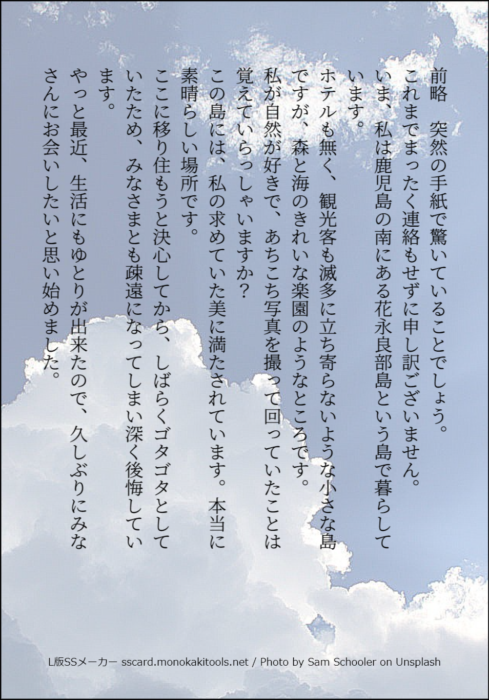
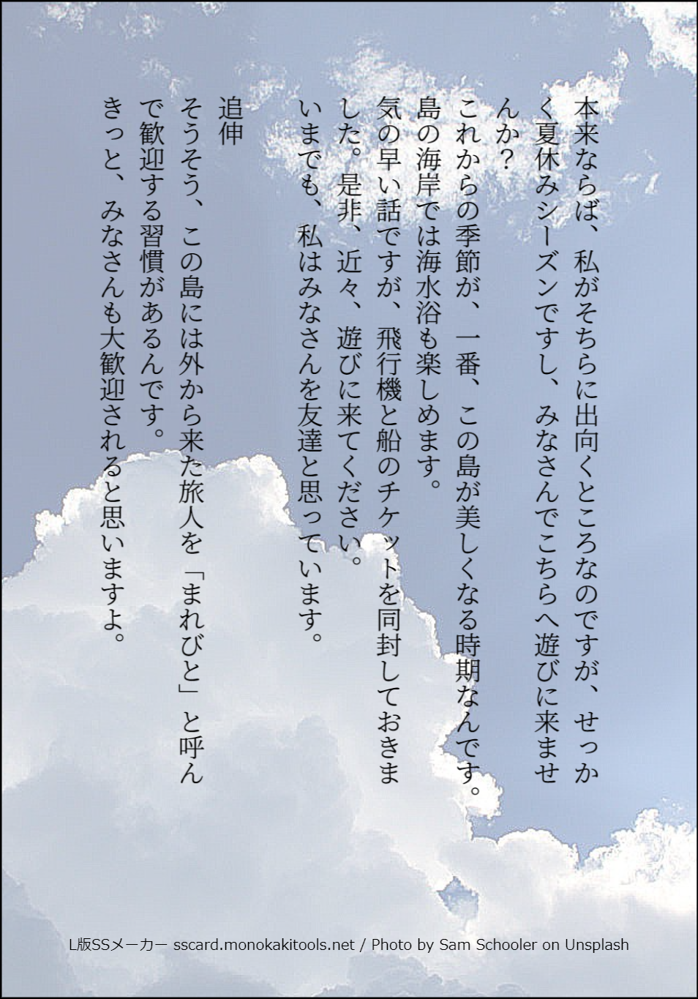

# アトラク・アイラ
[まれびとの島](http://coc.a.la9.jp/YASUmarebito.htm)を参考にしたシナリオ


NPC
---------------
### 白川修
- 39歳
- 人間
- 宿泊先の主人
- 備考
    - 9年前に島に移住
    - 大きめの家屋を譲り受け、部屋が余っているため探索者たちは彼の家に泊まることになる
    - やや陰気ではあるが、穏やかで人当たりは良い
    - 片足を失っており、杖なしでは1人で歩けない
    - 探索者の少なくとも1人は彼によって手紙で招かれた(全員でも良い)
- 真相
    - 9年前に写真を撮りに訪れた際に目を付けられ、この島に囚われている
    - 水子の糧とされて、POWを吸引されている

```
- STR:9 CON:9 SIZ:13
- INT: 9 POW:3 DEX:5
- APP:10 EDU:10 SAN: 50
- HP:10 ダメージボーナス: なし
- 技能: 信用50, 目星:50 写真術: 50
```


### 阿部穂波
- アブホースの落とし子
- 20代後半のような外見

```
STR:22 CON:20 SIZ:13
INT:17 POW:10 DEX:17
APP:16 EDU:17 SAN:0
HP:15 ダメージボーナス: 1D6
技能: 言いくるめ:60, 信用30, 心理学85, 歴史40
戦闘: 拳:70, 蹴り:40, ナイフ:60(1D6)
[その他]
- 1ターンに物理的なダメージを6回復
- ただし、火や酸、魔法などのダメージは回復できない
```

- 不思議な色気と知性を併せ持った魅力的な女性
- 切れ長の目に、美しい長髪。服装は、やや流行遅れのワンピース。時にはＴシャツにジーパンといったラフなスタイルになることもあります。
- 清楚な女性のように見えますが、時に彼女は男を誘うような隙を見せることがあります
- 彼女は人間というものを心理学や歴史に関する文献、さらにはテレビの通俗番組までを教材として２０年以上も貪欲に学び続けました。その結果、い までは完璧に人間を演じることができるようになっています
- しかし、それはあくまで知識として身につけているだけであり、彼女の精神の根底あるもののは、我々とは異質の神話的思想なのです


### 阿部水子
- アブホースの落とし子
- 10歳程度の外見
- いつもニコニコと笑っている可愛らしい少女
- 快活で腕白、いつもあちこちを動き回っている
- 白川や探索者たちにはベタベタと甘えてきます
- しかし、母親である穂波には甘える様子はなく、親子にしては素気なく見えます

```
- STR:17 CON:17 SIZ: 7
- INT:12 POW: 8 DEX:16
- APP:16 EDU: 5 SAN:0
- HP:10 ダメージボーナス:なし
- 技能: 心理学25
- 戦闘: 拳:50, 蹴り:25
[その他]
- 1ターンに物理的なダメージを6回復
- ただし、火や酸、魔法などのダメージは回復できない
```


### 須藤周二
- アブホースの落とし子
- 35歳
- 色黒でがっしりした体格と、典型的な海の男といった風貌
- 人なつっこいが、話題に乏しく、あまり空気を読むことができない
- そのためか、相手の様子を察さずに漁や魚の話を延々と続けがちである
- 実のところ、これは彼が人間心理を深く理解していないのを誤魔化すためである

```
- STR:20 CON:17 SIZ:17
- INT:10 POW:10 DEX:12
- APP: 8 EDU:11 SAN:0
- HP:17 ダメージボーナス:1D6
- 技能: 機械修理:60, 心理学:45, 船舶操縦:60, ナビゲート:40, 生物学:30
- 戦闘: 拳:70, 蹴り:40, 銛:60(1D6)
[その他]
- 1ターンに物理的なダメージを6回復
- ただし、火や酸、魔法などのダメージは回復できない
```

### 好広幸雄
- アブホースの落とし子
- 72歳
- 島の長老的な立場
- 陽気で探索者たちにも気さくに話しかけてくる
- 人の話をあまり聞いていないのか、返事もトンチンカンなことがある
- が、これはボケた振りをして、彼自身の人間認識の甘さを悟られないようにしているためである

```
- STR:19 CON:15 SIZ:14
- INT:14 POW: 8 DEX:15
- APP: 7 EDU:15 SAN:0
- HP:17 ダメージボーナス:1D6
- 技能: 図書館:40, 心理学:40
- 戦闘: 拳:60, 蹴り:30, 火掻き棒:40(1D6)
[その他]
- 1ターンに物理的なダメージを6回復
- ただし、火や酸、魔法などのダメージは回復できない
```

### 半谷四郎
- 人間
- 45歳
- 18年前に島を訪れた際、アブホースの落とし子が肉体に融合してしまい、失敗作として島で飼い殺しにされている
- ただし、まだ正気を保っている
- 胸部には落とし子が癒着しており、それを隠すようにダブダブの服を着ている
- 平時は落とし子は静かにしているが、半谷が落とし子の不利益となるような行為を取ろうとすると、激痛を与える
- 探索者たちが落とし子たちの犠牲になることを防ぐため、またこれを機に彼らに一矢報いるために行動を開始する

```
- STR:10 CON:11 SIZ:11
- INT:13 POW: 8 DEX: 9
- APP: 5 EDU:16 SAN:18
- HP:17 ダメージボーナス:なし
- 技能: 説得:50, 図書館:40, 歴史:60
- 戦闘: 拳:60, 蹴り:30, 鉈:30(1D6)
```

### ハマ婆(本名：西春ミヤ)
- 人間(漂流物収集家)
- 88歳
- 彼女も「まれびと」として、７２年前に島に招かれた人間です。
- 島民は彼女のことを浜辺をいつもうろついていることから、ハマ婆とか、ハマさんとか呼んでいます。
- 彼女の精神は完全に狂気に陥っており、ただ浜辺に流れ着く漂流物を拾い集めながら、海を眺めるだけの生活を続けています。

```
- STR: 5 CON: 5 SIZ: 9
- INT: 9 POW: 3 DEX: 6
- APP: 7 EDU: 8 SAN: 0
- HP:7 ダメージボーナス: -1D4
- 技能: 言いくるめ:60, 目星:80
```

### アブホースの落とし子
このアブホースの落とし子は、最初、芋虫程度しか動けない脆弱な存在です。
ただ、この落とし子の恐るべき能力は、生物のマジック・ポイントやPOWを吸引して成長することです。
その際、アブホースの落とし子は吸引した生物によく似た姿に成長していきます。
吸引したPOWは、アブホースの落とし子のPOWそのものになります。
POWが4になれば、アブホースの落とし子は、吸引した生物の赤ん坊のような姿になり 最低限の行動が可能となります。
ただし、赤ん坊の姿となったアブホースの落とし子は、それ以上のPOW吸引の攻撃はできなくなり、「６，花永良部島の秘密」で説明 されたようにマジック・ポイントをゆっくりと吸引することしかできなくなります。
なお、だいたいPOWが8を越えると、アブホースの落とし子はPOW吸引をしないでも、独自の力で生きていくだけの強靱さを得ます。

```
- STR: 0 CON: 1 SIZ 11
- INT: 1 POW: 3 DEX: 1
- HP:1 MP:3 ダメージボーナス:なし
- 武器: POW吸引 100(探索者が自ら振れた場合のみ)
    - MPでの対抗ロール
    - 成功した場合はPOW1の永続マイナス
    - 失敗した場合はMP1吸収
- 装甲：殴打および切りつけ無効。火や酸、魔術、魔力を付与された武器は通常のダメージを与えます。
- 単体遭遇でのSAN値減少は0/1
```

### アブホース
それは灰色の水溜りに浮かび上がった塊だった。
泡立つ塊からは無数のタコのような偽足が伸びる。
体から絶えず灰色の小さな不定形の塊が分離する。
生み出された塊は探索者に向かってくるが、その多くは偽足に捕らわれ貪られる。
不気味なことに自ら生み出した落とし子を食っているのだ。

```
- STR:40 CON:100 SIZ:80
- INT:13 POW:50 DEX: 1
- HP:90 ダメージボーナス:1D6
- 戦闘: 付属器官(つかむ、吸収):60
[その他]
- 毎ターン物理的ダメージを20回復
- 耐久が0になると地下深くに潜り追跡不可能になる
```


島民の行動原理
---------------------
- 探索者たちをアブホースの落とし子の糧するために、島に定住させようとする


花永良部島の秘密
---------------------
花永良部島の歴史と島民の正体について、キーパー用の情報を記します。

花永良部島に暮らす島民の大部分は、不浄の源アブホースを源とする、人間の姿を真似した神話生物です。
いまから約150年前、花永良部島に中規模の地震が発生しました。その地震による被害はほとんどありませんでしたが、ひとつだけ致命的な現象を引き起こしました。
それは島の井戸を、アブホースの鎮座する地下世界とつなげてしまったことです。
井戸から沸きだしたアブホースは、島中を覆い尽くし、すべての島民と島の動植物を吸収してしまいました。ちょうどこのとき、神は少しだけ空腹だったのです。
こうして花永良部島は一夜のうちに完全に滅びました。

それでも九州から近い位置にある島だったので、再び新しい入植者も来るようになりました。彼らは失われた木々を植えて防風林を作り、田畑を開墾し、井戸を掘りました。
そして、不幸な出会いが起きました。去っていったアブホースの落とし物である、アブホースの落とし子との遭遇です。
この落とし子は自分ではろくに動くことも出来ない脆弱な肉の塊でしたが、人間のMPやPOWを吸収することで、人間によく似た姿に成長することが可能でした。
島への入植がまだ完全に進んでいない時期に、彼らは島民の中に紛れ込み、順調にその数と人間に関する知識を増やしていきました。
やがて、彼らは人間との共存は不可能であると判断して、島民全員を自分たちの糧とし、アブホースの落とし子だけのコロニーを花永良部島に作ることにしました。
彼らは人間たちの脅威を理解していました。個々の能力は彼らの方が優れていますが、人間には圧倒的な数による力があります。そこで彼らは人間たち気づかれる ことなく、ひっそりと島で生きる術を模索していきました。本土との接触は最低限に保ち、辺鄙な島に暮らす外部と接触したがらない島民を演じることで、彼らは自分たちのコロニーを維持していったのです。
神ならぬアブホースの落とし子には寿命があり、約１００年で死んでしまいます（再生能力があるため、事故死や病死はないのですが、老衰で死ぬのです）。従って、自分たちのコロニーを維持するためには、新しい仲間を増やさねばなりません。
生殖能力の無い落とし子たちですが、島の中心にある巨大なスギの根本にある穴からは、自分たちの元となったアブホースの落とし子が無尽蔵に沸きだしています。このアブホースの落とし子に人間という糧さえ与えれば、仲間を増やすことが可能です。
アブホースの落とし子たちは、島に人間を誘い込み、彼らを虜としなければなりませんでした（彼らはその犠牲者を「まれびと」と呼んで最初は島をあげての大歓迎をして、底に潜む恐ろしい真意を隠しました）。
その人選は慎重に行われました。行方不明になっても怪しまれない者、島で暮らしたがっている者、身よりのない者などを見つけては、島に招いてアブホースの落とし子の糧として監禁していったのです。
完全に成長を終えていない子供のアブホースの落とし子は、毎晩、犠牲者の精神力を吸引します。
犠牲者はやがて狂気に陥り、抜け殻のようになって衰弱死します。
彼らは経験により、犠牲者が９年程度で使い物にならなくなることを知り(人間のPOWの平均は１０程度であり、確率的に犠牲者は１年に１ポイントのPOWを 失うからです)、９年に一度、島にまれびとを招くことにしました。あまり頻繁にまれびとを島に招くのは危険であるため、このぐらいの頻度が丁度よかったので す。

こうして花永良部島には、狡猾なアブホースの落とし子たちによるコロニーが形成され、表面上は田舎の平和な島を演じてきました。
いまから18年前、京都の大学生である半谷四郎が島を訪れた際に島民に捕まります。近年になると、行方不明になっても騒がれないという人間が減り、彼の失踪は事件となり ますが、島民たちは揃って口裏を合わせることで彼の行方を隠しました。
そんな苦労をして捕らえた半谷四郎ですが、思わぬアクシデントが起こります。貪欲なアブホースの落とし子が、彼と融合してしまったのです。そのアブホースの落 とし子は半谷四郎の身体と同化してしまい、引き離すことは出来なくなりました。
それでも同族には変わりないので、半谷四郎はそのおぞましい姿のまま殺されることもなく、さりとて島民として受け入れられることもなく、島で飼い殺しとされる ことになりました。
この神話的体験は半谷四郎の精神を崩壊直前にまで蝕みますが、それでも強靱な意志（高いPOW）で彼は人間としての正気を捨てませんでした。
海を渡らねば島を脱出することはできないため、島から逃げることは不可能です。
それに、怪物と融合してしまった姿では本土に戻ることもできず、彼に残された道は、島民達に蔑まれながらも森の中でひっそりと生き延びることだけでした。白 江剛は自ら死を選ぶような男ではなかったのです。
それから９年が過ぎて、今度は白川修が島に招かれました。
当時、18歳だった阿武穂波の魅惑に騙され、彼は家族の反対を押し切って島に移り住みます。
その後、白川修は本性を現した島民たちによって島に閉じこめられ、肉体的、精神的なあらゆる手段で島民たちに逆らう意思を奪い取られました。その過程には、彼の足の骨を折る行為も含まれていました。
半谷四郎と違って、軟弱な白川修はふぬけ同然として、島民の言いなりになって生き延びることしかできませんでした。
そして、彼を糧とするアブホースの落とし子は順調に成長し、阿部水子となりました。

一方、半谷四郎は白川修に密かに接触を続けました。
半谷四郎の異形の姿を、白川修が嫌悪したため、二人が理解し合うのには長い時間が必要でした。
しかし、半谷四郎は自分が生きてきたことの意味は白川修を救うことであると信じ、あきらめることなく説得を続けました。
島民たちに気づかれないように密会をしなければならなかったため、それは困難でしたが、半谷四郎の言葉は白川修の正気を保つ最後の命綱でした。
９年が過ぎて、このシナリオが開始した年、花永良部島では新しいまれびとを求める動きが始まります。
島民たちは白川修が探索者たちを島に誘い込み、その中にまれびとに相応しい人間（身寄りがいない、島に住みたがっている、阿武穂波に言い寄ってくるなど）がいないか探ろうとしています。
また、半谷四郎は新しいまれびとが呼ばれたことを白川修経由で知り、いまこそ島民たちに逆襲するチャンスと考えています。ただ、下手に行動をすれば島に来た探索者にも危険を及ぼすこととなりますし、なにより自分の姿を見られれば、こちらが化け物と勘違いされてしまうことは必至でしょう。
そのため、白川修に勇気ある行動とるべく最後の説得に当たっています。この言葉に白川修も心を動かされていますが、それでも島民たちへの恐怖は根強く彼の心を支配しており、いまだ踏ん切りのつかない状態が続いています。

このような様々に思惑入り交じる花永良部島に、探索者は訪れることとなったのです。

導入 白川修の手紙
---------------------
白川修から[手紙](./invite_mail.md)が届く




手紙の中には、飛行機のクーポン券と、島への交通機関の説明、あと島の風景写真が一枚同封されています。
それによると、鹿児島県の久屋島の港までは通常の交通機関ですが、最後に花永良部島に向かう船便はどうやら民間の漁船に便乗させてもらうようです。
なぜなら、船のチケットの代わりに、久屋島の港の漁協への紹介状が入っているからです。
また2枚の写真が同封されています。
1枚は誰もいない真っ白な砂浜の写真です。
もう1枚は南の国らしいガジュマルの生い茂る中でカメラを構えた白川の写真です。

《目星》か《写真術》に成功した探索者は次のように思います。
砂浜の写真は、美しい南の海の写真ですが、どことなく古びた印象を受けます。
白川の写真は、小さくしか写っていないのではっきり分かりませんが、幾分若い頃の写真に見えます。
これは白川修が最近写真を撮っていないため、昔の写真を阿武穂波が同封したためです。

手紙を読んで《知識》に成功した探索者は「まれびと」という言葉の意味を知っています。
まれびととは、一般的に珍しい客という意味で使われますが、民俗学的には遠方から訪れた人の姿をした神という意味もあります。
蘇民将来子孫における牛頭天王を典型的な例として、他にも有名なナマハゲ、沖縄に伝わる常世ニライカナイから来訪する祖霊など、遠くからやってきては人間に 幸を与えてくれる存在を「まれびと」と呼びます。
このようなまれびと信仰から、遠方から来た客を、まるで神様のように大歓迎してもてなすという習慣のある地域もあり、日本の古い信仰のひとつとしていまの時 代にも受け継がれています。

白川修と知り合いの探索者は、彼に関する以下の情報を知っています。

### 白川修の情報

白川修は、探索者と１０年ほど昔に交友のあった友人です。
学生時代の友人や、幼なじみという関係にするのが一番自然でしょう。
彼はおとなしいところはありましたが、人当たりの良いみんなに好かれるタイプの男でした。
田舎や自然が好きで、旅行に出ては美しい景色や、田舎の人々の写真を撮っていました。
その写真は白川修の人柄を映しているような優しい写真でした。
ところが、いまから９年前に彼との交際はパッタリと途絶えてしまいます。
いつのまにか、いままで住んでいたアパートも引き払われており、その後、彼とはまったく連絡が取れなくなってしまいます。
なお、実家に連絡をとるという探索者がいた場合、白川修はどこかの遠島で暮らしているという以外、何も知らないと両親は答えます。
どうやら、白川修は親と喧嘩をしたらしく勘当扱いとなっている様子です。

キーパーは探索者に、白川修の誘いに応じるように誘導してください。
年代的に無理があるなどの理由から手紙が届かなかった探索者は、他の招待された探索者に一緒に行かないかと誘わせてください。
白川修に連絡を取る手段は、封筒に書かれた住所に手紙を送るしかありません。
彼に近況や島について尋ねる手紙を出した場合、必要最低限の答えが書かれた返事が返ってきます。
そして、手紙の最後は、是非一度島に来て欲しいという言葉で終わっています。
この誘いに乗らないようでは、探索者として失格でしょう。
キーパーは遠慮無く、強気で押してください。

なお、この手紙は白川修が阿武穂波に脅されて書かされたのもで、手紙の内容も彼女が考えたものです。


 いざ花永良部島へ！
---------------------
### 花永良部島の情報
- 花永良部島についての情報はあまり出回ってはいません。
- 季節は7月初旬、この地域では梅雨明けが宣言された頃
- 九州の南約100kmに位置する久屋島、そこからさらに西へ100kmに花永良部島がある。
- 面積5平方km、周囲18km程度の小さな島。
- 花永良部島には定期便が出ておらず、久屋島の漁師が送り届けてくれる手筈になっている。
- たまに日用品を買いにくる以外、久屋島との交流もほとんどない。
    - ただし、島民の印象が特に悪いということもなく、無口だが礼儀正しい人々、という印象を持たれている。
- 島の奥の森には「風穴の大杉」と呼ばれるスギの巨木がある。
    - 生物学ロール成功で開示
- その名前の由来は、スギの根本にぽっかり空いた底の見えない大穴である。
    - 不思議な大穴の情報はオカルトロールに成功で開示
- 18年前の警察沙汰の情報
    - 歴史or民俗学ロール成功で開示
    - 警察関係者であればプラス補正を入れても良い

#### 18年前の警察沙汰
18年ほど前、花永良部島に渡った大学生が行方不明になるという事件がありました。
卒業旅行で九州をひとり旅していた京都の大学生が帰着の予定日になっても家に戻らず、数ヶ月に渡り音信不通となりました。家族からは捜索願が出され、警察がその足取りを追った結果、花永良部島を訪れたのが最後だったのです。
しかし、警察が島民たちに事情聴取を行った結果、大学生が島に訪れたのは間違い無いが、数日間、島に逗留したあと、島の所有する船で彼を久屋島まで送り届けたという話でした。
その後の足取りはまったく不明で、事件は未解決に終わっているそうです。

送り届けてくれる漁師に聞いた場合は、さらに次のことも分かって良いでしょう。
なお、大学生の名前は半谷と言ったそうです。
普通なら名前など忘れてしまいそうなものですが、たまたま、余り聞かない名字だったため覚えていたのです。
また、花永良部島のような辺鄙な島まで足をのばしていたのは、大学で研究していた動物学の調査も兼ねていたらしいという話も覚えています。

### 花永良部島への船
- 久屋島の漁師が花永良部島まで送り届けてくれる。
    - 警察沙汰の話は漁師から島の情報を得ようとした場合にも出して良いでしょう。
- 道中、漁師は探索者たちが退屈しないように気を利かせたのか、芋焼酎と魚を振る舞ってくれます
    - 漁師も飲酒運転になるのだが、探索者たちと一緒に酒を飲んでいます。
    - KPはここで実際に鹿児島の芋焼酎を振る舞うと良いでしょう。
- 漁師は気分が良くなったのか、歌と踊りを披露してくれます。
    - [もぐらのまつり](./song_mogura_no_maturi.txt)
    - これは遠海へ漁に行く者や、旅に出る者を歓送するための踊りで、昔からこのあたりに伝わるものだそうです。
    - **あるルートではクライマックスの伏線になるので忘れないこと**

### 島への到着
さて、そんな船上での宴会を続けていると、いつのまにか花永良部島へ到着します。
島の外観は、なだらかな丘が水面にひょっこりと顔を出しているといった感じの島です。
どうやら火山島のようですが、よほど古い時期に誕生したものらしく、風雨に浸食され島の形は起伏の少ないなだらかなものです。
島の三分の一は緑濃い森に覆われ、残りは畑や草地になっています。
島の植生を見て《生物学》に成功すると、島の木々が古くとも樹齢１５０年程度のものばかり で、森自体もその時期に生まれた新しいものであることに気づきます。
これは１５０年前に島の木々がすべてアブホースに飲み込まれてしまったからです。
その中で大杉の存在はかなり浮いたものだと思うでしょう。

そんな緑に覆われた島の表面を、まるでチョークで描いたかのように白い道が走っています。
島に点在する家の屋根の瓦は赤や青といったやや派手な色が使われていて、海から見ると、まるで小さなマッチ箱のようです。
青い空と海、白い砂浜と道、目にまぶしい緑の自然。その素晴らしい色のコンストラストは、南のリゾート島を彷彿とさせる光景です。
島の南側の海岸線は砂浜になっており、海水浴には絶好の場所です。
島の北側は岩場と森で、とても粗末な桟橋（地図の１です）があります。ここが花永良部島唯一の港です。
港に近づくと、船長は思いだしたように可愛く包装された包みを探索者に渡します。そして、
「前にこの島の港に寄ったときに、小さな女の子と会ったんだ。遊ぶ友達もいない辺鄙な島でひとりでは可哀想だから、これをプレゼントしてやりな。あんたらも仲 良くしてやってくれな。きっと島以外の人間に会えて喜ぶと思うからよ」 と、照れくさそうに語ります。
プレゼントの中身は、女の子向けの髪飾りです。
そのあと船長はベテランの腕を十分に生かし、巧みな操船術で船を桟橋につけます。

船が到着すると、桟橋の近くに建つ小屋から、年季の入った麦わら帽子を被った島民が顔を出してきます。
この人物は、島の船主である須藤周二です。
(ここで須藤の容姿等について説明)
須藤周二は探索者たちを見ると、「いやあ、遠いところようこそいらっしゃったなぁ。歓迎します」と、満面の笑みを浮かべます。
この後、彼が白川の家まで道案内してくれます。

※白川と半谷以外の島民は鹿児島の方言で話します。

### 白川宅へ移動
島内には自動車は1台もありません。島民の共用である、年代物の耕耘機が1台あるだけです。
また、電気、ガス、水道といったライフラインも届いていません。
島民は自家発電によって必要最低限の電力を得ています。燃料は石油か薪、炭が使用されます。 飲料水は井戸によって確保されています。
探索者の持っている携帯電話もいっさい通じません。
島の家々を結ぶ道は未舗装で、ほとんど通りかかる人はいません。
潮の音と、風のざわめき以外、何も聞こえないとても静かな島です。
島には小さな田んぼと、様々な野菜の育つ畑があります。
《博物学》か《生物学》に成功すると、あまり手入れの行き届いた田畑ではないことがわかります。
雑草は生え、虫の姿もよく見かけます。その理由としては、農薬や化学肥料をほとんど使用していないことがわかります。
有機農法と言うよりは、あまり手をかけずに自然任せに育てているといった感じです。

白川の家は島の南側に位置しており、歩いて３０分ぐらいの距離です。
道ばたには自動販売機どころか、商業看板すら存在しません。時々、農具小屋や朽ちかけた廃屋があるだけです。
日を遮るもののない炎天下の道は、この季節だとちょっとした苦行です。ただ、いつでも心地よい海風が吹いているので、帽子などを被っていれば我慢できないほ どではありません。
そんな道を、須藤周二は上機嫌で探索者を案内してくれます（とはいえ、道は延々と一本道が続いているだけです）。
途中、CONの一番低い探索者は、夏の強い日差しに目眩を感じます。
須藤周二は、四辻にある廃屋（「１４，島の情報」を参照）で休むことを提案します。
廃屋は遮るもののない島の道で、数少ない休める場所です。
中には古いクワなどの農耕具や、カゴ、ザル、ムシロ、割れた瀬戸物の皿、カエルの置物（さりげなく 描写してください。理由は「１４，島の情報」を参照）などが散らばっており、人が住まなくなって長い時間が過ぎ去ったことを感じさせます。

そんな廃屋で休んでいると、「ホォーウ、ホォーウ」という奇妙な声が遠くに聞こえてきます。
須藤周二は気にもしていない様子ですが、もし探索者が声について尋ねた場合、「あれは森に住んでる猿の声ですわ。みなさんも、あまり森の奥へは入らないほう がええですよ。イタズラされますから」と無関心な顔で答えます。

ここで《生物学》に成功した探索者は、あのような鳴き声を発する猿は九州に生息していないことを知っています。そのことを須藤周二に尋ねても、「けど、いるもんはいるんですわ。もしかすると、誰かのペットかなにかが逃げて、住み着いてるのかもしれませんな」と答えます。
この声の正体は白川です。彼は島に新しい犠牲者（探索者のことです）がやってきたことを知り、少しでも島に対して警戒をするように不気味な声を上げている のです。


白川修との再会
----------------

白川修の家（正確には阿武穂波の持ち家ですが）は、島の南側のなだらかに傾斜した土地に建っています。
付属の地図ではＮＯ．１０の位置です。
海風がやや強いことをのぞけば、砂浜の海岸線が一望できる最高の立地です。

斜面に石垣を積んで平らに整地された土地に、ぽつんと家は建っています。
まずは、台風の風雨を避けるための、高い石垣と防風林が目に付きます。
建物は、平屋で赤い瓦の古い木造建築です。屋根瓦は白い漆喰で補強されていますが、これもまた台風対策のためです。
軒が低いうえに、普通の屋根より広く張り出しているため、とても屋根が広く見え、やや圧迫感があります。
これもまた、強風を屋根の上へと受け流すための工夫です。
強度を保つため家全体に柱が多く、壁はコンクリートの部分もありますが、古い漆喰が残されている箇所もあります。ここから、何度も改築と修理を繰り返された 古い家であることが伺えます。
部屋を仕切るものは、ほとんどが板戸です。
障子や襖はあまり使用されていません。
ガラス窓は少なく、南に面した縁側など、家の主な場所にしか使用されていません。
《博物学》か《知識》か《歴史》で、この家が古い沖縄の住居建築の特色が濃いことがわかり、おそらく最初にこの家が建てられたのは百年ぐらい前のものと推測できます。
もちろん、当時の建材はほとんど改築の際に交換されていますが、家の形などは当時の姿を留めています。

花永良部島の家は現代建築に比べるとガラス戸を使用している場所が極端に少ないのに、家屋自体は広いので、奥まった場所だと昼間でも薄暗いところがあります。
廊下など、あまり生活に使用しない場所には照明器具もつけていないので、現代の家になれている人には、ずいぶん暗いという印象を受けるでしょう。しかし、 ちょっと前の日本家屋は、みんなこんな感じだったのです。
さらに、暑さに弱い探索者には酷な話ですが、花永良部島にはクーラーがありません
。唯一の冷房装置は白川修の家にあるカラカラとうるさい音を立てる古い扇風機だ けです。
それでも、現代建築のように壁で部屋が区切られた気密性の高い構造ではないので、戸を全開にしておけば、家の奥にまで海風が通り、それなりに快適に過ごすこ とが出来ます。
家電も少なく、テレビと冷蔵庫があるだけです。洗濯機はありません。
冷蔵庫も宴会などで使用される氷などを作るときのみ電気が入れられ、普段は電源は入れられていません。

白川修の家に着くと、須藤周二は呆れるほどの大声で「あ～ぶ～さ～ん！」と玄関口で呼びかけます。
この季節、戸という戸は開け放されているので、外からの声は筒抜けです。なお、この島の家には呼び鈴など存在しません。
すぐに家からひとりの女性が出てきます。彼女が阿武穂波です。
彼女は探索者を見て、こぼれるような笑みを浮かべて「遠いところ、よくいらっしゃってくださいました。
白川さんも心待ちにしておりましたわ。どうぞ遠慮無く お入りください。外は暑かったでしょう？」と歓迎の言葉で出迎えます。
肩を露出した水色のワンピース姿の彼女は、二十代前半から中頃ぐらいと、実年齢よりは若く見えます。

そのとき、もう一人の人物が探索者の後ろから現れます。
それはハマ婆さんです。
ハマ婆さんは首から、浜に打ち上げられたカワハギやフグの干からびたものにヒモを通して、数珠のようにぶら下げています。
魚の干物は、風に吹かれてカラカラ と乾いた音を立てています。 
ハマ婆さんは探索者たちの顔を見て、「あんたらが、新しいまれびとかね？」と尋ねます。
須藤周二はハマ婆さんが余計なことを言う前に、「婆ちゃん、ダメじゃないか。一人でうろついてちゃ危ないよ！」と言って、彼女を探索者から隠すようにして連 れて行きます。 
別れ際、須藤周二は「じゃあ、また夜に……」と言い残していきます。
この「夜に」という言葉は、夜に開かれる探索者の歓迎会のことを指しています。
探索者がハマ婆さんについて尋ねた場合、阿武穂波は言いにくそうに、島で一人暮らしをしている老人で、最近少しボケてしまっていると簡単な説明をします。

探索者は阿武穂波と白川修の関係に関心を持つことでしょう。
彼女は「修さんは、この家に下宿しているんです。田舎の島ですから、アパートなんてありませんし。古い家なんで、部屋数だけはたんさんあるんですよ」と答えます。
探索者はとりあえず玄関脇の部屋に荷物を置くようい言われ、そのあと薄暗い板張りの廊下を渡り、家の奥まった場所にある一室へと案内されます。
夏なのに、その部屋は板戸を締め切っています。
阿武穂波は板戸をノックして、「修さん、開けますよ？」と呼びかけてから開けます。
部屋の中はかなり薄暗く、カラカラと古い扇風機が部屋にこもった熱気をかき回しています。
畳の和室に、多くの写真器材が置かれており、写真の処理剤のものらしい酸っぱい臭いがします。
壁にはコルクのボードが何枚もかけられており、そこに写真が何 枚もピンでとめられています。
中には年月が経って、端が丸まってしまったものもあります。
あとは低い書き物机がある程度で、写真一筋といった部屋の様子です。
その書き物机に背中をもたれるように、白川修は畳の上に腰をかけています。
暑さのためか、上着のボタンを外して、少しだらしない格好をしています。
そして、白川の膝を枕にして少女が甘えるように、身体を丸くして寝転がっています。この少女は阿武水子です。
白川修は探索者たちがやってきても、物憂げに顔をあげるだけです。
このとき《心理学》１／２に成功すると、彼の表情の奥に驚きと戸惑いが隠されていることを感じ取ります。
このときの彼は探索者が本当に島にやってきてしまったことに、激しい後悔を感じており、探索者が自分と同じ運命を辿ることを、なんとか阻止しなければと考えています。
ただ、阿武穂波と水子の前で、不用意なことを言えば、逆に探索者たちの身を危険に曝す可能性もあります。
一番良いのは、探索者が島民に見込まれることな く、そして島の秘密に気づくことなく、早々に島を立ち去ってくれることですが、そのためにはどうすれば良いのか、彼は懸命に考えているところなのです。

阿武穂波はやや呆れた顔で、「まあまあ、二人とも……お客様の前でなんて格好ですか……」と二人をたしなめます。
阿武水子はピョンと立ち上がると、ジロジロと探索者を見たあと「お母さん、この人たちがお父さんのお友達？」と、好奇心一杯の顔で尋ねます。
すると「この人たちなんて、失礼ですよ。すみませんね、みなさん。田舎育ちで礼儀を知らなくて」と、阿武穂波は困り顔で笑いかけます。
しかし、探索者にとっては、そんなことより「お父さん」「お母さん」という言葉のほうが気になることでしょう。
その問いについては、「誤解なさらないでくださいね。この子は私の子ですけど、父親は白川さんじゃあないんです。この子の父親は、昔、私がつきあっていた人 なんですが……いまどうしているかは知りません。私、一人でこの子を育ててきました。けれど、この子ったら、やっぱり寂しいんでしょうか……白川さんをお父さんと慕っていましてね」と、阿武穂波は答えづらそうに話してくれます。もちろん、この話は真っ赤な嘘です。

そんな会話のあとから、やっと白川修は「やあ、みんなよく来てくれたね……」と、かすかに笑みを浮かべて、あまり覇気のない口調で挨拶をします。
９年ぶりの再会であるせいか、白川修の態度はどこか探索者と距離を置いた感じがします。
また、少しやつれた感じで、島暮らしをしているわりにはそれほど日に焼けてもいません。もっとも、それも病的というほどではありませんが。
阿武穂波は「ここじゃあ、みなさん落ち着かないでしょうから。居間のほうに行きましょうか」と、白川修をうながします。
すると、白川修はゆっくりと立ち上がります。
そのとき探索者は、彼の右足足首の三十センチぐらい上あたりから、その先が無くなっているのに気づきます。
この足について尋ねられると、「島に来た頃、大きな怪我をしてね……」と力無く笑います。阿武水子は何もいわれないでも、白川修を支えるようにして傍らに立 ちます。そんな二人の動作はごく自然です。
彼は人の助けが無いと、ほとんど歩くことが出来ません。坂が多く、未舗装の島内の道を、一人で歩くことは困難です。そのため、多くの時間を阿武水子に助けられて過ごしています。
白川修の足は、彼が島にやってきたときに島民たちによって切断されました。それは彼の自由を奪い、勝手な行動をさせないためです。

防風林と海が望める縁側に面した居間で、探索者はくつろぐことになります。
麦茶とスイカが出され、風鈴が涼しげな音を奏でています。
白川修は、主に探索者と過ごした昔の話を懐かしむようにします。島での暮らしについては、島の写真を撮り続けているといった程度のことしか話しません。そんな白川修の態度を見て《心理学》に成功すると、あまり島のことを話したくないのではと推測できます。
その間も、阿武水子は白川修にベッタリとくっついて、探索者のほうをニコニコ笑いながら見つめています。
会話に割って入ってくることはありませんが、それで も楽しそうに話に聞き入っています。

ここで阿武親子に興味を持つ探査者もいるでしょう。
阿武穂波は阿武水子の父親については、あまり話したがりません。
また、阿武水子は小学校に通う歳ですが、町の生活が合わなかったため休学中であると話します。詳しい話については、阿武穂波は言葉を濁し、この島で暮らす だけなら学校に行かなくても勉強する方法はいくらでもありますから、と言葉を締めくくります。
何をして生計を立てているかについては、あまりはっきりと語りません。
探索者がしつこく尋ねるようでしたら、島民たちで畑の世話をしており、その畑の作物で現金収入を得て、島民全員で分配していると話します。そして、この島で はみんなが家族のようなものであり、それにこの島で暮らしている限り、あまり現金の使い道はないので、と付け加えます。
実際、この島では須藤周二の船の維持費と、最低限の生活雑貨以外、ほとんど現金を使うことはありません。食料については、ほぼ自給自足が可能です。

探索者が船長から預かった髪飾りのプレゼントをあげると、阿武水子は予想以上に喜びます。
探索者が忘れているようでしたら、キーパーが思い出させてやってください。
すぐに阿武穂波にせっついて髪に結んでもらうと、部屋の中をピョンピョン跳びはねながらクルクルと回って踊り、白川修や探索者に自慢げに見せてまわり「似合う、似合う？」と尋ねます。
その様子は実にほほえましいものですが、そんな彼女に対して白川修の反応は素っ気ないものです。
《心理学》に成功すると、もしかして白川修は阿武水子を嫌っているのではないかと推測できます。

そうこうしているうちに、やがて日は暮れはじめます。
阿武穂波は探索者たちに「いまお風呂を沸かしますから、長旅の汗を流してさっぱりしてください。今晩は島のものを呼んで、ささやかな宴会を開く予定ですので……」と言って、阿武水子にお風呂を沸かすように言いつけます。
ちなみに、この家の風呂はなんと薪風呂です。
しかも、水は土間にある井戸のポンプから水を汲み上げて運ぶという、現代人にはとても考えられないような不便なものです。
探索者がのんびりしている間に、阿武水子は不平ひとつ言わずに水を運び、薪に火をつけています。もし、気の優しい探索者がこの作業を手伝ったとすれば、その あまりの重労働にヘトヘトになることでしょう。
風呂の準備について、阿武水子は「いつもやっていることだから、全然平気よ」と明るく笑います。
キーパーはここで阿武水子が見た目よりも体力と筋力があることの伏線を張っておきましょう。
もっとも、あまり露骨にすると怪しく思われるので、軽く描写する程度で構いません。


まれびとの宴
-----------------

夜になると、探索者を歓迎する宴会が、白川修の家にて開かれます。
探索者が風呂に入っている間に、村人たちはバラバラと適当に集まり出します。

集まる島民は、阿武穂波、阿武水子、須藤周二、好広幸雄です。
好広幸雄は焼酎の一升瓶を４本ほど、志和夫婦は取れたての夏野菜、須藤周二は新鮮な魚など、みんなが食材と酒を持ち寄り、台所では阿武穂波がその食材の 調理にめまぐるしく動いています。
他の人は、あまり料理には手を出しません。理由を聞けば、阿武穂波の料理の腕には及ばないから邪魔をすると悪いと答えます（実際は、食事の味など興味のな い彼らは、料理などほとんど出来ないのです）。
料理は鹿児島の郷土料理がメインです。
ブリ、アオリイカの刺身などは珍しくはありませんが、今朝、須藤周二が島の岩場で銛突きでしとめたというイシダイの活き作りなどは、なかなか料理店では食べ られない高級魚です。
また、鹿児島らしい料理としては、黒豚の角煮、豚耳の酢みそあえ、レバーの味噌漬け、豚足を味噌と黒砂糖で煮込んだものといった豚づくし。
さらに、有名なきびなごの刺身（甘めのみそだれを付けて食べます）、定番中の定番である薩摩揚げなどが並んでいます。
宴会に欠かせない酒は、当然、薩摩の芋焼酎です。
当たり前といった調子で、一升瓶が何本も並べられ、探索者たちを圧倒します。
鹿児島料理に慣れていない探索者は、その全体に甘い味付けに戸惑うことでしょう。
なんと刺身につける醤油ですら、ここ鹿児島では甘いのです。これは慣れない人間には抵抗あるものです。
しかし、この甘い味付けは、辛口の焼酎によく合います。
酒好きの探索者は、その絶妙な組み合わせについつい杯を進めてしまうことでしょう。

宴会の席では、島民たちは主に探索者の話を聞きたがります。出身地や仕事、家族のことなどです。こうして情報を聞き出すことによって、まれびとに相応しい探 索者に目星をつけているのです。
島民たちは実に陽気で、探索者たちにひっきりなしに酒と料理を勧めます。島民たちは、あまり食事や酒に手をつけずに、まるで探索者の相手をしたくてしょうが ないといった感じです。
酒宴が続いても、島民たちは、ほとんど酔っぱらう様子がありません。
《目星》か《アイデア》に成功すると、彼らが探索者に酒を勧めるばかりで、あまり酒を飲 んでいないのに気づきます（もし、探索者が無理に島民に勧めても、神話生物である彼らにアルコールは効かないのですが）。
また、対称的に白川修のほうは浮かない顔をして、隅のほうでチビチビと焼酎をストレートで飲み続けており、料理にもほとんど手をつけていません。
その傍らには、まるで猫がじゃれついているように阿武水子が寄り添っています。
しかし、白川修はそんな可愛い少女のことなど眼中に無いといった様子で、じっと探索者たちのほうを無言で見つめています。
彼に話しかけたとしても、ボソボソと必要最低限の返事をするだけです。
《心理学》に成功すると、彼は何か強い不安を抱えているのではないかと推測できます。
この宴会の途中、白川修は阿武穂波と松坂愛子が料理のおかわりを運ぶため席を外したとき、こっそりと友人である探索者に近づいて、
「ボクは弱い……弱い人間なんだ。おねがいだ、少しだけ時間をくれ。まだ時間はある……そう時間ならあるんだ」
と、小さな声で呻くようにささやきます。そのときの彼は、まるで泣き出しそうな顔をしています。
そのとき阿武穂波が戻ってきます。
すると、白川修はすぐに元の場所に戻って何事もなかったかのように焼酎をあおり、すべてを拒絶するようにうつむきます。
阿武穂波は白川修の態度など気にもしていない様子で、この宴会を心から楽しんでいるといった楽しげな表情で探索者に明日の予定を尋ねます。
もし、探索者に 予定がないようなら、彼女は目の前の浜辺で海水浴をしてはどうだろうかと提案します。
花永良部島は本当に何もない島なので、おそらくは探索者もこの提案に従うこと でしょう。
この話を聞いた白川修は、「せっかくだから、水子も一緒に遊んできなさい」と口を挟みます。
阿武穂波は彼の提案を聞いて「そうですね。もし、みなさんがお邪魔でなければ……わたしたちも、ご一緒させてもらってよろしいですか？」と探索者に尋ねます。
この申し出を断るような探索者はいないでしょう。

宴もたけなわとなり探索者も相当に酔っぱらった頃、《聞き耳》×２に成功すると戸を開け放した縁側の庭の防風林のほうからかすかに「いるよ～、いるよ～」と いう声が聞こえてきます。
それはしゃがれていますが、子供の声のように聞こえます。
探索者がその声に気づいても気づかなくても、島民たちはその声に気づき縁側のほうをじっと見つめます。
ここで《目星》に（先程の《聞き耳》に成功している探 索者は《目星》×２）成功した探索者は、防風林の奥に部屋の明かりを受けて、ぼんやりと人の顔が浮かび上がっているのに気づきます。
人相はよくわかりませんが、どうやらヒゲの濃い中年男性のようです。
その男性はぼんやりとした目で、部屋の様子を見つめています。
その男の立っているあたりから、例の声は聞こえてきました。
その直後、一番縁側に近いところに座っていた須藤周二は、何も言わずに、いきなり驚くほど機敏な動きで裸足のまま縁側へ飛び出します。
その動作には一瞬の躊躇もなく、まるで特別に訓練された警備員や軍人の動きを思わせます。
須藤周二の神話生物の本能が、そのような素早い反応をさせたのです。
探索者があとを追っても、もはや防風林に立っていた男の姿は消えてしまっています。
《追跡》に成功しても、足跡などは残っていないため追跡できません。
しばらくすると須藤周二が戻ってきて、「追い払ってやりました」と平然とした顔で報告します。
探索者が男のことを尋ねると、須藤周二は「できそこないが迷い込んできたようです。気にすることはありません」と答えます。
それに対し、阿武穂波は厳しい声で「お客様に、そんな汚い言葉を使うものじゃありませんよ」と須藤周二をたしなめ、「ああ、みなさんお騒がせしてすみませ ん。あの人もこの島の住人なんですが……仕事をすることなく、島の畑を荒らしたりするもので……島の人にも嫌われていまして」と説明します。
もっと詳しいことを聞くと、何年か前に島にやってきて勝手に住み着いた。
北側の森に小屋でも建てて暮らしているらしいが、詳しいことはわからない。
名前すら知らないので「森の人」とか「できそこない」と島民は呼んでいるといった程度のことは教えてくれます。
あの中年男の正体は、１８年前に行方不明となった半谷四郎の変わり果てた姿です。
島民たちは彼の正体についてよく知っていますが、当然、探索者には秘密にします。

半谷四郎は新しく招かれた「まれびと」の様子を、こっそりとうかがいに来ました。
ところが、家に近づいたところで彼の身体に宿るアブホースの落とし子が目を覚まし、島民達に忠告を与えたのです。それが「いるよ～」という声の正体です。
彼はその声に驚き、須藤周二がやってくる前に逃げ出しました。

半谷四郎が現れると、白川修は青ざめた顔をして「飲み過ぎて気分が悪い」とぶっきらぼうに言い残し、宴会の席を立ちます。
阿武穂波は心配そうな顔で「水子、治さんについていておあげ」と言います。
すると、阿武水子は探索者たちに明るく「おやすみなさいっ！」と挨拶してから、片足のうえ、少し酔いが回った白川修の身体を支えて部屋を出ていきます。
彼らのあとをついていくと、二人はそのまま家の外に出ていきます。
どこへ行くのか尋ねられると、夜道を散歩して酔いを醒ますつもりだと話します。
彼の行動の理由については「惨劇の始まり」を参照してください。

もし、探索者が白川修のことが気になり一緒に外に行こうとしても、すぐに島民たちがやってきて宴会の席に連れ戻そうとします。
それでも強引に白川修に付き 添った場合、彼は四辻まで歩いて、廃屋で少し休んでから家の戻ります。
その間、阿武水子はひとときも彼のそばから離れないで、身体を支えてあげています。
そして、無言の白川修とは対称的に、阿武水子は探索者のことなどをいろいろと尋ねてきます。

宴会に参加している探索者は、自分からお開きを申し出るか、それとも焼酎にノックアウトされるまで、延々と宴会は続きます。
島民たちは、最後の最後までつきあいます。それは驚愕すべきタフネスさです。

なお、この島では夜でも板戸は開けっ放しです。
島民全員が顔見知りの狭い島で、戸締まりなど気にする必要はありませんし、何より夜とはいえ板戸を閉め切ったりしたら暑くて眠れません。
蚊などの害虫対策は、蚊取り線香と蚊帳があります。
都会育ちの探索者にとっては、蚊帳の下で眠るというのは新鮮な体験となるでしょう。


逢い引きの夜
--------------------

宴会を終えた深夜。
探索者の誰かひとりがこのイベントに遭遇します。
その選択はキーパーに任されますが、白川修の友人か阿武水子に関心を持っている探索者を選ぶと、その探索者にとっても衝撃的で良いでしょう。

夜、選ばれた探索者はトイレに行きたくなり目を覚まします。
月に照らされるだけの暗い廊下をトイレを求めて歩いていると、白川修の部屋の前を通りかかります。部屋の板戸は少し開かれており、その隙間からクスクスとい う阿武水子の小さな笑い声が聞こえてきます。
興味を持った探索者が中をのぞくと、衝撃的な光景が繰り広げられています。
中では一糸まとわぬ姿の阿武水子が、上着のボタンを外され胸をはだけた白川修の身体に愛撫をしているのです。阿武水子の白い裸体が月に照らされうごめき、そ れは妖艶な光景です。
白川修は目を半開きにして、ぼんやりとした顔つきでされるがままになっています。
阿武水子は、このとき白川修から精神力を吸引しているのです。

ここで探索者は《忍び歩き》か《幸運》をする必要があります。
失敗すると、うっかり物音を立ててしまい、中の二人に気づかれてしまいます。
気づかれなかった探索者は、こっそりとのぞき続けるか、部屋を離れるか、白川修に声をかけるといった行動選択が出来ます。
のぞき続けた場合、五分もすると阿武水子は満足したように白川修の横で裸のまま寝入ってしまいます。白川修もいつのまにか目を閉じて、ぐったりと疲れたよう に眠りについています。
白川修に声をかけた場合、下記の気づかれた場合と同じイベントが発生します。

白川修が探索者の存在に気づいた場合、彼は阿武水子を乱暴に突き飛ばし、ガバッと身を起こします。
そして、廊下に向かって「誰だ！？」と叫びます。
ここで返事をしないで部屋に戻れば、それっきり静かになります。
もし、白川修の問いかけに対して探索者が名乗りを上げた場合、彼は顔をぐしゃぐしゃにして泣きながら「出ていけ！　すぐに出ていけ！　私のことはほうってお いてくれ！」と取り乱します。
《精神分析》に成功すると、白川修の反応は正常なものとは思えず、強度のストレスから精神衰弱（精神症の初期段階）に陥っている のではないかと推測できます。
その間、阿武水子は裸のままで恥ずかしがることもなく、屈託のない笑みを浮かべて白川修と探索者を見比べています。
探索者が嫌がる白川修に無理矢理に話を聞こうとすれば、騒ぎに気づいた阿武穂波が部屋にやってきて、白川修を一人にしてやってくれと間に入ります。
また、他の眠っている探索者は《聞き耳》か《幸運》に成功すれば、この騒ぎに気づいて目を覚まします。
普通の探索者ならば、あまり口にしたくないような内容ですが、さきほどの二人の行動について阿武穂波に尋ねた場合、「水子は修さんのことを愛しているんです。それは父親への愛とも、異性への愛ともつかない……」と言って言葉を濁し、それから「すみません。今晩のことは忘れください。お願いします」と頭を下げます。


### イベント
- 探索者たちは幸運ロールを振る
- ロールに失敗した探索者たちは1D6+1ポイントのMPを消耗する
- ファンブルした場合はさらにPOWを1永続的に失う
- これはアブホースの落とし子がこっそり探索者たちから精神力を奪うため


浜辺のひととき
------------------

探索者が花永良部島に到着した翌日。
阿武穂波の提案に従えば、この日は、みんなで海水浴を楽しむことになるでしょう。
浜辺までは白川修の家から数分の距離ですので、家で水着に着替えてから浜辺に行けばよいでしょう。
海水浴には阿武穂波と水子の二人が同行します。白川修は足を悪くしていることを理由に同行はしません。
シナリオの展開上、ここで白川修は家にひとりで残る必要があります。
もし、探索者が白川修につきまとって離れないようでしたら、松坂親子に一緒に行こうと強く誘われるといった行動をとらせて、彼から引き離してください。
白川修自身も体調が悪いと言って、探索者が家に残ることを嫌います。なぜなら、このあと半谷四郎との密会をすることになっているからです。
阿武穂波は白いハイレグ水着に麻のシャツをはおった姿。手には昼食のおにぎりの入ったバスケットに、麦茶の入った魔法瓶を持っています。
阿武水子のほうは黒いスクール水着（水着の名札には「まつざかりえこ」と書いてあります。
この水着は彼女のお古なのです）のうえに白のＴシャツを着て、大きな麦わら帽子を被っています。

当たり前の話ですが砂浜には探索者以外に海水浴客はいなく、プライベートビーチのようなものです。
東側は岩場になっており、素潜りでも十分に魚などを見ることが出来ます。

阿武穂波は一児の母とは思えない若々しい姿で、探索者を魅了します。
彼女はまるで少女のようにコロコロと楽しげに笑い、探索者たちと一緒に遊びます。
そして、阿武水子はゴムまりのように探索者のまわりで跳ねて転んで、疲れ知らずにはしゃぎまわります。
昨晩の阿武水子の行動を目撃してしまった探索者は、複雑な気分でしょうが、松坂親子は昨日のことなど無かったことのように無邪気にはしゃいでいます。
まるで、昨晩のことは探索者の見た悪い夢であったかと錯覚させるほどです。

昼時が近づくと、須藤周二が大きな冷えたスイカをふたつほど持って現れます。
須藤周二はこれでスイカ割りでもしてはどうかと提案します。
須藤周二は魚捕り用の細い銛（魚扠）を持ってきています。彼に頼めば貸してくれるので、東側の岩場で魚捕りに挑戦してみるのも楽しいでしょう。

一見、楽しいバカンスですが、島民たちは密かに新しいまれびとの候補を探索者の中から選び出そうとしています。
阿武穂波に興味を持った男性の探索者などが、その主な対象となるでしょう（中には阿武水子に関心を持つ探索者もいるでしょうが）。

キーパーはタイミングを見計らって（昼から夕方にかけての時間帯が適当でしょう）、阿武水子の姿が見えなくなったことを探索者に告げてください。逆を言え ば、阿武水子が一人になった時を見計らって、彼女に単独行動をさせてください。
もし、探索者の誰かが阿武水子を気に入ってぴったりとくっついているような場合は、スイカ割りで目隠しをしているときなどを利用して、彼女に単独行動をさせ ると良いでしょう。
いなくなった阿武水子が何をしているのかは「惨劇の始まり」を参照してください。
海で子供の姿が見えなくなれば、普通の大人ならば溺れたりしていないかと心配をすることでしょう。
神話生物である阿武水子が溺れることはあり得ないことを知っている阿武穂波は、娘を心配する演技をしながら、もしかして何かの用事で家に戻っているのではないかと妥当な考えを述べます。


惨劇の始まり
-------------------------

### KP情報
楽しいバカンスのように思えた島の生活に、突然の惨劇が降りかかります。
まずは惨劇の真相を説明します。これは探索者は遭遇することのないイベントで、キーパー用の情報です。

白川修は探索者が島にやってきてしまったことに、強い後悔を感じています。
そこで探索者を歓迎する宴会を抜け出し、島内で唯一の仲間である半谷四郎に秘密の連絡方法（「島の情報」の四辻の廃屋を参照）で会いたいという意志を告げました。
翌日、何も知らない探索者たちが阿武穂波たちと遊んでいる隙を狙って、半谷四郎は白川修の家にやってきました。戸締まりをする習慣が無い家なので、それは実 に容易なことです。
探索者の中から自分のような新たな犠牲者が選ばれるかもしれないという罪悪感と、島民たちへの恐怖に板挟みにされ、白川修は半谷四郎に助言を求めようとしたの です。そして、半谷四郎はこれ以上新たな犠牲を出さないよう勇気ある行動を取るべきだと、白川修を説得します。

しかし、不幸なことにこの密談は、たまたま家にタオルを取りに来た阿武水子に立ち聞きをされてしまいます。
彼女は天使のような顔で、そんなことはやめていままで通りに島で暮らそうと白川修に抱きついて懇願します。
一瞬、その無垢な姿に決心が揺らいだ白川修ですが、すぐに我に返って抱きつく阿武水子の顔を乱暴に突き飛ばします。
そのとき偶然、彼女の顔に当たり、髪飾りをもぎ取ってしまいました。
『自分のものが取られた』
そんなささいなことですが、これをきっかけに阿武水子の神話的な魂は目を覚まします。阿武穂波のような成熟したアブホースの落とし子ならば、そんな感情を 抑えることも出来たでしょうが、幼い阿武水子には無理なことでした。
彼女は少しの躊躇もすることなく、部屋の隅に立てかけられていた写真撮影用の三脚で白川修を無慈悲に何度も殴りつけます。彼女の肉体能力は見かけとは違い、 強靱な成人男性並みです。足の不自由な白川修は、その獣的な攻撃から逃れることはできませんでした。
半谷四郎はそれを止めるため阿武水子から三脚を奪い取ろうと揉み合いますが、彼女の外見からは予想できない力に、どうすることもできませんでした。
やがて半谷四郎は恐ろしくなって、白川修を見捨てて窓から逃げ出してしまいます。白川修の次は、自分が殺されると考えたからです。
こうして、平和に見えた島の化けの皮の一枚目がはげ落ちたのです。

### 探索者イベント
次からは、探索者の遭遇するイベントです。

探索者が阿武水子を探すため家に戻るとき（シナリオの都合上、戻る時間に関わりなく）、《目星》に成功すると、白川修の家から何者かが飛び出して東側の林へ と走り去るのを見かけます。
その人物とはかなり距離があるので、すぐに林の中に入られて見失ってしまいます。

家に入ってみると、不気味なまでにシーンと静まりかえっています。
探索者が家に入ると、玄関の廊下で、水着の上に着た白いＴシャツを血で真っ赤に染めた阿武水子がぼんやりと立っています。
目の下あたりに誰かにひどく殴られたらしいアザがついており、髪飾りのゴムが片方なくなって髪の毛が垂れ下がっています。
その姿を見て、白川修の身に何かあったことを悟った阿武穂波は何も言わずに彼女を抱きしめます。ただし、それは娘に対する愛情からではなく、探索者の前で 阿武水子に下手なことを言わせないためです。
阿武穂波は厳しい声で「ここでじっとしていて」と阿武水子に言うと、家の奥へと向かいます。白川修の部屋へ行こうとしているのです。
そのあとを探索者はついていくことは可能ですし、すぐに部屋へ向かうことも可能です。

白川修の部屋では凄惨な光景が広がっています。
部屋中に飛び散った血と、血まみれの三脚。
無惨に頭を割られ、全身にもひどい打撲を受けた白川修の死体。
畳にこびりついた血の足跡は入り乱れ、部屋で行われた凶行の様子を物語っているかのようです。
すぐに白川修の様子を確認しようとした探索者は、彼のダイイングメッセージを受け取ることができます。
白川修はすでに喋ることは出来ません。
ガクガクとアゴを動かしながら、血まみれの手を書き物机に置いてあった本に置いて、そのまま事切れます。
白川修の無惨な姿を見た探索者は、０／１Ｄ３正気度ポイントを失います。
なお、彼との旧友である探索者は、１／１Ｄ４正気度ポイントを失います

手がかりは無数にあります。
以下に箇条書きにしてあるので、探索者の調査に応じて情報を提供してください。

### 白川修の死体
白川修は完全に死亡しています。身体はまだ暖かく、死んでから間もないことがわかります。
外傷はひどく、見たところ頭を強く殴られたことが死因のように思われます。
《医学》に成功すると、身体の打撲のいくつかは動けなくなってからさらに殴られ続 けたものであると推測できます。
白川修の右手の小指には、阿武水子の髪飾りのボンボンが引っかかっています。この髪飾りも血まみれです。

### 凶器の三脚
三脚には大量の血と、白川修の髪の毛が付着しており、これが凶器であることは間違いないようです。
三脚には血糊で手形が残っています。《目星》に成功すると、手形は二種類あります。ひとつは小さな子供ぐらいの手形で、もうひとつは大人の手形です。
これは阿武水子と半谷四郎の手形です。二人がもみ合っているときに、手形がついたのです。
三脚の重さは約４ｋｇあるので、これを凶器として振り回すには成人男性並みの筋力が必要でしょう。

### 畳の足跡
畳の足跡を調べて《目星》１／２か《追跡》に成功した探索者は、足跡が三種類あることを突き止めます。
成人男性のものと思われる裸足の足跡が二種類。
もうひとつは、小さな子供ぐらいの足跡です。
足跡の種類ではなく動きを詳しく調べて、《アイデア》１／２か《追跡》に成功した探索者は、この部屋で何があったのかを推測することが出来ます。
わかりやすく三種の足跡をＡ（白川修）、Ｂ（半谷四郎）、Ｃ（阿武水子）に分類します。
Ａの足跡は動きを追っているうちに、白川修の死体につながるので誰のものかはすぐに判明します。
足跡自体の数は少なく、動きも少ないのであまり参考にはなりません。
ただ、大量の血を流してからは、さほど身動きが出来なかったであろう事が推測できます。
そんな白川修の足跡を、別の足跡が踏んでいる部分もあります （このことは白川修が身動きが取れなくなってからも、部屋で誰かが動いていたことを意味しますが、それは探索者に説明してあげる必要はないでしょう）。

Ｂの足跡は、一番活発に動いてます。畳に擦れて残っているものが多いことから、部屋で激しく動いていたことが推測できます。部屋の窓枠に残っていることか ら、この人物が窓から外に出たことが推測できます。

Ｃの足跡は、小さな子供の足跡ということから、阿武水子のものであると探索者は容易に推測できることでしょう。
この足跡も部屋には多数残っています。
ＢとＣの足跡の位置から、二人が争っていたのではないかと推測できます。
その後、足跡はまっすぐ廊下へと続いています。
阿武水子の足と照合してみれば、それはピッタリ一致することがわかります。

### ダイイングメッセージの本
白川修が最後に示した本です。
奇妙なことに、白川修の部屋にはこの本以外に、本らしいものはありません。
内容は松尾芭蕉の生涯と俳句に関する本で、内容自体はさほど珍しいものではなく普通の書店で流通していそうな本です。出版年月日は約１９年前です。
本の最後のページにはしおりが挟まっています。
そのしおりには、京都の大学の付属書店の名前が書いてあります。
この本は半谷四郎の所持品であった本を、好広幸雄が自分のコレクションに加えたものです。
白川修は半谷四郎の本を指し示すことで、彼に会うよう探索者に告げたかったのです。
もし、阿武穂波に本のことを尋ねれば、それは好広幸雄に借りたものだろうと答えます。
ただし、露骨に事件に関係ありそうに尋ねた場合、彼女は本の出所を惚けて教えません。

### アルバム
事件には直接は関係無さそうですが、白川修の部屋を自由に調査できるようになった探索者は、彼の島での生活に興味を持つかも知れません。
白川修は日記をつけるような習慣はありませんでしたが、彼が写真家であることを考えれば、アルバムを見てみようとする探索者もいることでしょう。
アルバムには、探索者と過ごした頃の古い写真が大事に保管されており、何度も見返したあとが残されています。それ以外の新しいアルバムには、島の風景写真が 納められていますが、島民の姿はいっさい映されていません（島民の正体を知る白川修としては当然のことでしょうが）。
これは風景写真が好きだというレベルを超えて、これは少し奇妙に感じられることでしょう。
アルバムから得られる情報はこの程度です。

これらの手がかりを照合した探索者は、おそらくは島に住む謎の人物（半谷四郎）が怪しいと考えることでしょう（先読みの好きな探索者は阿武水子が怪しいと思うでしょうが）。
阿武穂波は白川修の突然の死にショックを受けている様子で呆然としています。
これは探索者の同情心を煽ろうとしている演技です。
彼女は自分に好意を持っている探索者に、心細い気持ちを吐露してさらに気をひこうとします。

事件の目撃者である阿武水子に何を目撃したのか尋ねる探索者もいることでしょう。
阿武穂波はそのことに対して、母親としてあまり思い出させたくないとして良い顔はしません。
それでも尋ねた場合、阿武水子は白川修とヒゲの男が喧嘩をしていたと語ります。
ヒゲの男は三脚で白川修を殴ったので、それを止めようとしたが無理だった。
顔の傷はヒゲの男ともみ合ったときに殴られたあとだ、と語ります。
懸命な探索者ならば、白川修の指に引っかかっていた髪飾りのことを思い出すでしょう。
なぜ、彼の指に髪飾りがあったのかを尋ねられると、阿武水子はきょとん と小首を傾げて、なぜだか自分にもわからないと答えるだけです。

この島には電話などの本土との連絡手段が無いので、本土の警察を呼ぶためには須藤周二の船に頼るしかありません。
驚くべき事に、この島には緊急時連絡用の無線機すら無いのです（須藤周二の船の無線機は故障しています）。
賢明な探索者ならば、船に乗って外部に応援を呼ぼうとすることでしょうがそうは簡単にいきません。
探索者に警察を呼ぶように要請を受けた須藤周二は快く引き受けますが、いつまでたっても船を出航させることはありません。
彼の言葉によると、船の機関部の重要な部品がいつのまにか抜き取られているということです。
須藤周二は怒りを隠そうともせずに、口汚く「できそこない」のことを罵ります。
探索者が機関部を調べて《機械修理》に成功すると、須藤周二の言うとおり機関部の重要な部品が外されています。
代替のきく部品ではないので、このままでは船を動かすことが出来ません。
また、《機械修理》が１／２で成功している探索者は、この部品は船のアキレス腱とも言える部品で、それを選んで抜き取ったとしたら犯人はずいぶんと船の機関部に精通した人物であると考えられます。
探索者は知り得ないことですが、この部品を抜いたのは水野国彦自身です。
彼は、探索者や半谷四郎が船を使って逃げ出さないようにするため、部品を抜き取り隠したのです。


島民達の行動
-----------------------

白川修の殺人事件のあと、須藤周二が先頭に立って、半谷四郎の捜索が行われます。
島民たちが一番恐れているのは半谷四郎が警察に捕らわれることです。そんなことになれば、この島の秘密が知られてしまいます。
そうさせないためには、半谷四郎を見つけだし、自分たちの手で殺害し、死体を遺棄しなければなりません。そうすれば流れ者の精神異常者による通り魔的犯罪とし て処理されるだろうからです。
次に恐れていることは、白川修というエサが無くなってしまい、阿武水子が飢えてしまうことです。
このまま人間のマジック・ポイントとPOWが与えられない時間が続くと、普通の生物と同様に餓死してしまいます。彼女はほぼ成長を終えていますが、人間の食 物を食べて身体を維持できるようになるには、あと少しだけエサとなる人間が必要なのです。
そのため探索者を島に滞在させることに、より積極的になっています。

白川修の死体は船が直り次第、警察に提出しなければならないため、夏場ですが家の風通しの良い部屋に、そのまま保存されます。
葬式は半谷四郎の捜索が先決と、保留されます。
島民たちは白川修の遺体や葬式について、妙に無頓着です。それよりは半谷四郎の捜索のことばかりを優先します。

島民たちは、探索者が独自に半谷四郎を捜すことを嫌います。
客人を危険にさらすわけにはいかないというのが口実ですが、実際のところは、半谷四郎から島の秘密が漏れることを恐れているのです。
島民たちは、探索者にこの事件が解決するまで家でおとなしくしているようにと言われますが、ここでおとなしくしているようでは探索者失格でしょう。
探索者が自分たちも捜索に加わると強く主張すれば、島民も渋々それを認めます。その際、島民たちは島の南側を捜索してくれと地域を分担します。これは半谷四郎 が隠れていそうな島の北側に、探索者たちを近づけないための策です。
半谷四郎を探しているのは、ハマ婆と阿武穂波、阿武水子をのぞく島民全員です。
もしも、探索者が島民に秘密で行動する場合、島の道をのんきに歩いていてはすぐに見つかってしまいます。ただし、畑のあぜ道などをこっそりと進めば、島民の 数は少ないので、隠れて移動することは容易です。

阿武穂波は、白川修の死に心を痛めている演技で探索者の気を引こうとします。
自分に好感を抱いている探索者に対して、気丈に振る舞いながらもふと見せた弱さといった様子で、白川修を失った事による心細い気持ちを吐露します。
彼女は島に暮らす若い人が減ってしまったことについても不安を感じていると言います。島の過疎化が進んでしまうこともさることながら、老人ばかりに囲まれた 生活では阿武水子が可哀想だと言うのです。しかし、先祖代々暮らしてきた島を自分が離れるわけにもいかないと、苦悩する演技をします。

エサを失ってしまった阿武水子は、探索者のひとりに妙に懐くようになります。
あれほど懐いていた白川修の死についてはあまりショックを受けてはいない様子で、探索者に構ってもらうと嬉しそうに笑みさえ浮かべます。
彼女は隙あればマジック・ポイントを吸引してやろうとも考えています。しかし、そのためには対象の地肌に長時間触れていなければなりません。そのような隙を 見せる探索者はあまりいないでしょう。
この松坂親子の行動については、キーパーは探索者の様子を見てさじ加減をしてください。探索者が松坂親子に対してあまりに無警戒だった場合は、彼女たちの心 変わりの早さを強調して演出すると良いでしょう。逆に、探索者が松坂親子を警戒している場合は、あまり露骨に演出すると、早々に二人への疑惑を固められてしま い、これからの展開に支障をきたすこととなるでしょう。


島の情報
----------------------

この項では、島の主要な場所についての説明を記しています。
付属の地図に書かれた番号に、下記のナンバーは合わせてあります。探索者が島を散策するときや、探索をするときの参考としてください。

### ＮＯ．１「港と漁船」
島唯一の港です。ここには須藤周二の持ち船である古い小型漁船があります。
ひとりでも操縦することができ、熟練した船乗りである須藤周二ならば、この船で久屋島の港まで渡ることも可能です。
探索者が操縦するには《船舶操縦》の技能に成功する必要があります。
この船には無線機がついていますが、実はずっと昔に故障してしまっています。
修理してみようとしても、中の基盤が完全に腐食してしまっているので、交換用部品がなければ手の出しようがありません。
また、探索者が島にいる間、船の操舵輪には頑丈な鎖と南京錠が取り付けてあります。
この鍵を外すためには《錠前》１／２に成功しなければなりません。
半谷四郎や白川修を島から逃がさないように、船の管理は厳重にされているのです。しかも、いまは探索者が来ているのですから、さらに船に関しては用心をしてい ます。
なお、この船には救命用のゴムボートに、ライフジャケットや発煙筒などの救命器具が揃っています。
キーパーは探索者が船の見学をするようなことがあったら、忘れることなく救命ボートの描写をしておいてください。
後の伏線となるからです。

### ＮＯ．２「須藤周二の小屋」
港のすぐ近くに、須藤周二の小屋があります。
古い沖縄建築の面影を残す、阿武穂波の趣深い家とは対称的に、彼の小屋は素人が手を抜いて建てた掘っ建て小屋といった感じです。
錆びたトタン板や、古い板を無秩序に組み合わせて、なんとか雨風をしのげる空間を造りだした程度の小屋です。
中は粗末な板張りに、せんべい布団がひいてあるだけで、家具らしいものはほとんどありません。
この小屋は台風シーズンのたびに暴風で吹き飛ばされてしまうため、大切な物はすべて船の中に置いてあるのです。
ただちょっと変わったものとして、《目星》に成功すると、部屋の隅にビニールにつつまれた本が置かれてあるのに気づきます。
ビニールを取って（このビニール は海風で本を傷めないための工夫です）中を見てみると、それは幕末期の薩摩の歴史書です。
九州の大学教授が書いた、かなり堅い内容の本で、あまり一般向けの本 ではありません。
須藤周二がこのような本を読んでいることは、ちょっと意外な一面でしょう。
この本は好広幸雄から借りたものです。
小屋に井戸はなく、部屋の隅に大型のポリタンクが置いてありそこに、飲料水を溜めています。
身体や食器を洗う水は、目の前にいくらでもある海水を使っていま す。

### ＮＯ．３「四辻の廃屋」
南北に走る島の道が交差する場所です。
かといって島の中心地というわけではなく、あたりは見渡す限りの草地と畑です。
辻のわきには、人が住まなくなって十年以上は過ぎていると思える廃屋があります。
中は暗く、屋根に出来た隙間から漏れる日差しだけが、家の中をわずかに照らしています。
夏の日差しをしのぐにはちょうど良い場所でしょう。
家に入って人のいた形跡はないかを調べて《目星》か《追跡》に成功すると、自分たちの足跡以外に比較的新しい足跡を三種類発見します。
まず、成人男性程度の 大きさの足跡で、普通のサンダル等の足跡（片足のみ）と杖をついたのあと。
そして、成人男性のものらしい裸足のあと。最後に明らかにサイズの小さい子供のものらしい足跡です。
これは白川修と半谷四郎、阿武水子の足跡です。
阿武水子に廃屋のことを尋ねた場合、白川修は島を散策するときに、よくこの廃屋で休んでいたことを話してくれます。
土間をあがってすぐの板間に、瀬戸物のカエルがポツンとひっくり返った状態で置かれてあります。そのカエルを調べてみると、板間にはホコリが厚く積もってい るというのに、このカエルとその周囲だけはあまりホコリがついていません。
この廃屋は、白川修と半谷四郎が秘密の連絡を取り合う場所でもありました。カエルは二人の秘密の暗号です。
カエルが正しい位置で座っていた場合、白川修が半谷四郎と会いたいというメッセージなのです。それを確認した半谷四郎はカエルをひっくり返します。
メッセージを受けた半谷四郎は、こっそりと白川修の家へ忍び込み、二人は秘密の会合を続けていたのです。
なお、参考までに、探索者が島に来たときカエルはひっくり返っています。その後、宴会を抜け出した白川修の手によって正しい位置に戻されます。そして、その メッセージを受けた半谷四郎の手によって、またひっくり返されます。

### ＮＯ．４「好広幸雄の家」
好広幸雄の家は、阿武穂波の家と同様に古い琉球建築の面影を残す家です。
部屋数は阿武穂波の家よりも少なく、だいぶ古びた感じがします。特に屋根の老朽化は激しく、部屋の中には雨漏りする場所まであります。
現在、花永良部島にある人の住んでいる家の中では、好広幸雄の家が一番古いものです。
建物自体はさほど大きくありませんが、敷地は広く、いろいろと興味深いモノがあります。
まず、島で必要な道具の納められた物置小屋があります。農具や大工道具、工具、ガソリン、ロープなど、壊れたり腐ったりしないものであれば、基本的に物を捨 てるようなことはないため、百年近く集められた様々な道具やガラクタが揃っています。ただ、整理されることなく雑多に納められているため、必要なものを探すの は非常に面倒です。
ここは探索者が必要な道具を調達するにはもってこいの場所となるでしょう。
この物置小屋の脇には、この趣ある家の雰囲気には似合わないプレハブ小屋が建っています。
プレハブ小屋には、部屋一杯に大量の本が収められています。好広幸雄は雨漏りのする書庫から、蔵書を移動させるために増築したのだと話します。また、島民 たちの図書館代わりにもなっていると付け加えます。
好広幸雄に頼めば、中の本を読ませてもらうことは可能です。ただ、あまり乗り気ではない様子です。いつもは愛想が良いのに、その態度はちょっと不思議に思 えるでしょう。
プレハブ小屋の本については、「１５，プレハブの本」を参照してください。
さらに、敷地内を少し歩けば、家から一分程度歩いた防風林の奥に、ひっそりと隠れるように大きな井戸を見つけだせます。
石を組んで作られた古い井戸ですが、上にはコンクリートの蓋が乗せられ、さらにそれを漆喰で固めてあります。
この蓋と漆喰は井戸に比べれば、最近に作られたものです。
好広幸雄に井戸のことを尋ねると、涸れ井戸なので誰かが落ちないように塞いであるのだと説明します。ところが、この涸れ井戸の底にはアブホースの落とし子 が潜んでいます。詳しくは「１７，井戸の底」を参照してください。


### ＮＯ．５「島民(モブ)の家」
モブ島民の家です。
かなり小さな家で、生活も質素そのものです。
二、三十年前の農村の暮らしをいまに残す、そんな雰囲気の家です。
家電はほとんど無く、電気が必要なものと言えば居間の中央にぶら下げられた裸電球と、テレビだけです。
このような家で、明らかにテレビだけが浮いているような気がしますが、志和夫婦は娯楽の少ない島ではテレビぐらいしか楽しみがないからだと説明します。

### ＮＯ．６「ハマ婆の小屋」
海風に曝された高台には、島一番の長老であるハマ婆が暮らす小屋があります。
風に耐えるよう屋根が極端に低く、小屋のまわりには防風林が植えてあり、そのおかげでなんとか台風をしのいでいるようです。
高い位置にあるため井戸もなく、海風も強いので、あまり住み心地の良い土地ではありません。そのうえ、小屋も風雨によってだいぶ痛んでいるというのに、ほと んど補修のあともありません。
同じ粗末な小屋でも、機能重視で必要最低限なものだけを押さえている須藤周二の小屋とは違い、ここの小屋は形あるものが朽ち果て、消えていく過程といった感 じです。
小屋の中もひどいものです。
半分は土間で、残りは板間となっています。ただ、土間も板間もガラクタがうずたかく積み上げられ、まともな足の踏み場など玄関から入って数歩分しかありませ ん。
一言でガラクタと言っても、ここのガラクタにはすべて共通点があります。
それは海から流れ着いた漂流物であるということです。
パッと目に付くモノだけでも、様々な形をした流木、漁師の使う網の浮き、ガラスの空き瓶、ペットボトル、救命用の浮き輪、発煙筒のついたままのライフジャ ケット、セルロイドの人形の一部、お菓子のビニール、椰子の実、魚（骨となっている大型の魚から、小型のフグやカワハギの干からびたものまで）、その他の海洋 生物（ウニの殻、ヒトデ、オウムガイ、タコブネ、イルカの頭蓋骨）、小物の入った箱（磨かれたガラス片、綺麗な貝殻、ペットボトルのキャップ、釣りの浮き、 １００円ライター、ペンのキャップなど）といった具合です。
これらが床に積まれるだけでなく、壁にかけられたり、天井から糸で吊されてカラカラと音を立てていたりします。
このガラクタの奥にハマ婆は埋もれるようにして暮らしています。
彼女は探索者が来ると、「まれびと様」と呼んで歓迎してくれます。
とは言え、この小屋に探索者を歓迎できるようなものはまったくありません。
振る舞われるものといえば、溜め置きしてある一升瓶に入った水ぐらいなものです。
この漂流物の山について尋ねられると、「広い海から、やっと流れ着いたんだ。大変だったろうに、ここで休ませてやっているんだ。私たちと似ているから」と答えます。
その意味について尋ねても、あまり明確な答えは返ってきません。
ただ、「みんな同じだ」「海は広いから」「流れ着くんだ」といったことをブツブツと呟くだけです。
ハマ婆の言動は、突拍子もなく、意味不明なところが多く、まともな話など出来ません。
彼女の様子を見て《心理学》か《精神分析》か《医学》のどれかに成功すると、彼女の奇妙な行動は重度の老人性痴呆症か、それとも精神を病んでいるためと推測 できます。
つまりは、彼女は正常ではないと言うことです。
もし、探索者が彼女の本名を島民たちに尋ねても、昔からハマ婆と呼びならしているので本名はよく知らないと答えます。
もっとも、その本当の理由は世間では行 方不明扱いになっている彼女の本名を探索者たちに知られたくないからです。
すでにPOWが低くなりすぎて、彼女は「まれびと」としての役目を果たせなくなっています。
島民（主に好広幸雄）は、そんな彼女に最低限の食事の世話はしてあげています。残り少ないとはいえ、彼女のPOWは緊急時にアブホースの落とし子の糧とし て利用できなくもないからです。


### ＮＯ．７「北の森」
周囲８ｋｍ程度の、さほど広い森ではありませんが、百年以上にわたって人があまり立ち入らなかったため、昼間でも薄暗い不気味な雰囲気のする森です。
ここは、いまでも島民たちの重要な燃料源である薪を提供してくれている森です。
夜に森に入った場合、懐中電灯などの明かりを所持していない限り、まともに歩くことも出来ません。
地面には木の根が無秩序に張り巡らされ、腐った落ち葉は非 常に滑りやすく、うっそうと生い茂る木々は方向感覚を狂わせます。
森の中には、半谷四郎の隠れ住む小屋があります。
小屋を探して、森を探索した場合、１時間ごとに《目星》１／５か《地図製作》か《追跡》のどれかに成功すれば、半谷四郎が長年に渡って踏み分けた道を見つける ことが出来ます。
この道を辿れば、彼の小屋を発見することが出来ます。
古い木材とすっかり錆びてボロボロのトタン板、どこかで拾ってきたらしいビニールシートなどで建てられた、まさしく掘っ建て小屋です。
中には見るべきものは何もありません。ボロ布の切れ端や、一升瓶、口の欠けた湯飲み、海を流されてきたものらしいペットボトルなどが、木の枝で組み立てられ た棚に後生大事に並べられています。これらの家財道具が、彼の唯一の財産なのです。
また、小屋にはガソリンの入ったポリタンクの容器がふたつあります。質素な小屋には、ガソリンを使うようなものはまったくないので奇妙に思えます。
このガソリンは半谷四郎が、涸れ井戸の奥に潜むアブホースの落とし子の種を燃やそうと考え、島民から盗んだものです。
このガソリンは探索者の武器ともなるでしょう。

### ＮＯ．８「永良部山と岩場」
花永良部島で一番高い山です。標高は低く、なだらかな丘といった感じです。
地面には火山岩がゴロゴロしており、この島が火山島であった名残を感じることが出来ます。
頂上まで登っても木々が生い茂っているため、景色は良くありません。
このあたりの森は植生が新しいので、さほど歩きづらいものではありません。森を歩いて《生物学》×２に成功すれば、この森が誕生してから百年程度しか経って いないことがわかります。
また、火山性の島ですので海岸の岩場を歩けば、波に浸食されて出来た洞窟なども存在しています。
洞窟に入って《目星》か《地質学》×５に成功した探索者は、洞窟の壁面などに波状の模様があることに気づきます。岩肌がヤスリで削られたようにデコボコして いるのです。さらに《地質学》に成功すれば、この岩がこのような模様になったのは百年前後であり、また波の浸食などの自然な作用ではこのような跡が残ることは ないこともわかります。
この模様を見て《生物学》×２か《博物学》に成功すると、これが岩に付着した藻を食べる巻き貝などが残す、噛み跡の模様に似ていることに気づきます。
これは花永良部島をアブホースが飲み込んだときにできた跡です。洞窟内部は風や植物に浸食されることなく、その時の爪痕が生々しく残されているのです。
これらの洞窟に半谷四郎は身を隠すこともあります。
探索者は島全体を歩き回ってみて、狭いわりには身を隠す場所は多そうだという印象を受けることでしょう。

### ＮＯ．９「南の砂浜」
白川修の家から、歩いて数分のところにある美しい砂浜です。
この砂浜には潮流の関係から、海に浮かぶ漂流物がよく流れ着きます。早朝、海を散歩すれば、そんな漂流物を拾い集めるハマ婆さんの姿を見ることが出来ます。
もちろん、この砂浜は海水浴をするには絶好の場所でもあります。海水浴のイベントについては、「浜辺のひととき」を参照してください。

### ＮＯ．１０「風穴の大杉」
樹齢100年程度の木々が茂る森にあって異様な存在感を放つ杉の大樹です。
木の根本には巨大な穴が空いています。
転落防止のためか、柵で囲われています。

この大樹はアブホースの力によってできた魔樹です。
年月を経た樹木らしく灰色の樹皮には複雑な凹凸があり、その荘厳な外見で見るものを圧倒します。
しかし、感受性の高い者はどこか不気味さを感じるかもしれません。


プレハブの本
-----------------------

好広幸雄の敷地にあるプレハブには三千冊程度の本がぎっしりと収められています。
これらの本は、もともと母屋に置かれていたものですが、屋根の老朽化が激しくなり、貴重な本を雨で濡らしてしまわぬように、このプレハブを新築して移したの です。
蔵書の内容は、百科事典、歴史、心理学、哲学、農学、古典文学などで、最近の小説などはほとんどありません。
これらの本は島民が長い年月をかけて、人間の歴史や心理を学ぶ目的のため収集されたものです。
そのため、本のジャンルはやや偏ったものとなっています。
ただ、最近ではテレビのほうが勉強になるため、あまり本を購入することもなくなりました。そのため、ほとんどが４０年から７０年ぐらい昔の本です。
この蔵書を見て《図書館》に成功すると、この本を集めた人は、哲学や歴史から、人間の本質を見いだそうと考えている人ではないかと推測でき、その目的に集め たとするならば、蔵書の充実ぶりには感心させられるものがあります。
どれもが堅苦しく、文学作品ですら人間の心の葛藤を描いたような、肩の凝る内容の本ばかりです。
そんな蔵書の中に変わったものはないかと探した場合、《図書館》か《目星》１／５に成功すれば、本の中に例外的に比較的新しいものがあるのに気づきます。
それは民俗学に関する数冊の書籍です。
奥付けを調べてみると、２０年ぐらい前に出版された本であることがわかります。また著者を見て《知識》か《人類学》か《歴史》に成功すれば、この本は京都の 大学の教授が書いたもので、その教授の授業の教科書として利用されているぐらいで、一般書店にはほとんど流通していないものであることがわかります。
また、本には京都の書店名が書かれたしおりが挟まっています。このしおりは白川修が死ぬ間際に指し示した本に挟まっていたしおりと同じものです。
この本は半谷四郎が持ち歩いていたものを、好広幸雄が蔵書に組み込んだものです。
これらの本を本棚から抜き出すと、奥に小さな手帳が挟まっていることに気づきます。
手帳には小さな文字で、いろいろと書き込まれてあります。
その内容は前半のスケジュール帳の部分には、大学の授業の日程や、旅行の出費記録、旅先で書いた数行だけの日記などです。日付などは１８年前になっていま す。大学や日付から類推すれば、これが行方不明となった半谷四郎のものだろうと探索者は考えることでしょう。
手帳の後半部分の無地の部分には、俳句と民俗学に関する考察が記されており、手帳のしおり代わりのヒモが、その俳句の書かれてあるページに挟まっています。
この俳句は、半谷四郎が旅行の途中に記したものです。
俳句の内容は以下の通りです。

「辻に立ち　かわずの声で　道を決め」

白川修はこの俳句をヒントに、廃屋のカエルを使ったメッセージを思いつきました。
また、民俗学の考察については、この島についての記録があります。
以下に、その内容を箇条書きにします。

・島の歴史は３００年ほど前の文献にて紹介されたのが最初である。
・約１００年前ぐらいから、ほとんど九州とは交流をすること無く、島独自の生活を続けていたらしい。島民の数も、３００年前の記録では４０人程度とされている が、その後、１５０年前ぐらいからは極端に島民が少なくなっている。
・この時期には、島も複数の名前で呼ばれていた。狐火島、青木島、大木島などである。
・本土と疎遠であったため、昔の文化を色濃く残す貴重な島である。
・しかし、島にまつわる独特の伝承などが島民からは得られなかった。得られた話は、鹿児島や琉球に伝わる良く知られたものばかりであった。
・島民の方言は、この地方の古いものであるため期待していたが、期待はずれであった。
・乱暴な推測であるが、一度、この島の島民に大規模な移動があったのではないだろうか。その理由としては、津波や大地震などによって、島民の大部分が犠牲とな り、新しい住民が移民したなどが考えられる。
・ただし、いまのところ、それを裏付けるような災害の記録は無い。島民が激減したことは間違いないようだが、その理由について記された文献が無いのだ。

また、本棚の一番下の隅には黄ばんだ古い新聞が挟まっています。
なんと、その新聞は７２年も前の鹿児島県の地方新聞です。
古いこと以外には、とりたてて珍しいことはありませんが、隅から隅まで読み尽くす（１時間ほどかけてから《日本語読み書き》に成功する必要があります）か、 枕崎近辺の事件や行方不明事件を探してみた場合、１８年前の半谷四郎の事件とよく似た記事が載っています。
記事は小さなもので、行方不明になったのは「高山イチ」という若い女中（当時１６歳）で、最後に彼女の姿が見かけられたのが久屋島の港であるという程度しか書 かれていません。
この記事は、ハマ婆が島に連れてこられたとき、段取りが悪く警察沙汰になってしまったため、島民達が、事件の情報を集めていたときのものです。
結局、その事件は、この新聞記事が載ったぐらいで世間に騒がれることなくうやむやに終わりました。

プレハブ小屋で調べものをしている探索者は《アイデア》に成功すると、わずかな地震が発生したことに気づきます。ほんの少しの揺れですか、《地質学》に成功 すると、それが普通の地震とは違った揺れをしていた気がします。
このとき《聞き耳》に成功すると、どこか敷地の奥から「ブゥーブゥー」という奇妙な音が聞こえます。それは、下手な奏者がトランペットに力任せに息を吹き込 んでいるような音です。
その音の正体を探して敷地を歩くと、涸れ井戸を発見します。このあたりから音が聞こえてきたようなのでずか、この時点では音の正体はわかりません。
この地震と音は、涸れ井戸の底にいるアブホースの仕業です。


半谷四郎との対面
-----------------------------

警察に力を借りることが出来なくなった探索者は、半谷四郎を自分たちの手で捕らえようとするか、せめて話を聞きたいと考えることでしょう。
ですが、無闇に探したところで、島の地理を島民たちよりも熟知している半谷四郎を見つけだすことは困難です。
賢明な探索者ならば、四辻の廃屋にあったカエルと足跡、半谷四郎の俳句、その他の情報を統合して、カエルの座りかたの関係まではわからずとも、これが何らかの 連絡手段となっているのではと推測できるはずです。

半谷四郎と接触するための簡単な方法は、あまりスマートではありませんが四辻の廃屋で張り込みをすることです。
半谷四郎はあのあと白川修がどうなったか心配をしています。そして、もし彼が無事であれば必ずカエルの位置を変えることで自分にメッセージを送るだろうと考 え、島民の目を盗んで廃屋に様子を見に来ます。
そこを取り押さえれば良いというわけです。
他にも、カエルを正しく座らせておけば、半谷四郎はおそるおそる白川修の家に忍び込んできます。そこを取り押さえるという方法もあるでしょう。
キーパーは探索者がこれ以外の良い作戦を思いついたのなら、それを採用してあげても良いでしょう。
キーパーはプレイ時間と相談をして、このイベントを発生させてください。
時間に余裕があって、探索者がこの島の探索が不十分であると判断した場合、このイベントをなかなか発生させないことで、シナリオの展開を調整することが出来 ます。
また、今後のシナリオのイベントは夜に行われると雰囲気が増すので、半谷四郎が現れるのは夜であることにしておくと良いでしょう。

このイベントは出来る限り探索者だけで遭遇したほうが、後の展開がスマートになります。
もし、この段階でまだ島民に警戒心を抱いていない探索者が、島民たちと一緒に半谷四郎との対面を使用としている場合には、半谷四郎が警戒をして現れない（すぐに 逃げ出してしまう）などといった展開にすると良いでしょう。

半谷四郎は探索者たちと遭遇すると最初は逃げだそうとしますが、相手が島民でないことがわかると逆に話しかけてきます。
その言葉は震え、落ち着きのないものです。
手には錆びた鉈のようなものを持っています。探索者が手放すように言っても、頑として手放そうとはしません。
また、時々、会話が食い違ってしまったり、人のことを無視してどんどんと話を進めたりします。《精神分析》に成功すれば、彼が神経衰弱に陥っていることがわ かります。
話が核心に迫ると、彼の声は次第にどもり、うわずったものになり、過度に興奮をはじめ、呼吸が異常に激しくなります。

実に話しづらい相手ではありますが、それでも半谷四郎は事件のあったときのことをすべて正直に話し、他にも探索者に質問されるがままに、知っている限りの島の 秘密について語ろうとしています。
彼は１８年もこの島で暮らしてきた結果、多くの秘密を知っています。

・島民の中に、人間によく似てはいるが、まったく違うバケモノが潜んでいること（誰がそうであるかは、半谷四郎もはっきりわかっていませんが、白川修を虜として いた、阿武水子は間違いなくバケモノであると断言します）。
・島民たちが人間を島に誘い込み、「まれびと」として虜にすること。
・その目的は、バケモノの糧とするためであり、「まれびと」となった人間は十年近くかけて徐々に精気を吸い取られているらしいこと。
・この島の人間たちの目的は、その化け物を守り育てることである。

といったことを知っています。
半谷四郎にはクトゥルフ神話の知識が無いので、そのバケモノがアブホースの落とし子であることはわかりません。
この話を信じるかどうかは探索者次第です。
キーパーは半谷四郎の情緒不安定な態度を、誇張して演技して、その言葉を鵜呑みにして良いものか探索者に悩ませてください。賢明な探索者ならば、彼の言葉をそ のまま信じるということはしないでしょう（実際は正しいのですが）。
そのように探索者に疑いの目で見られると、半谷四郎はさらに興奮し始めて、自分は正しいとわめき立てて、
「風穴のアレを燃やすんだ。俺はアレに近づくことは出来ない。おまえ達が燃やすんだ！」
と、鉈を突きつけながら迫ります。ここでキーパーは半谷四郎の興奮した様子を過剰に演出して、探索者が彼の言葉を１００％信じるに値するかどうか悩ませるよう にしてください。
すると、そんな半谷四郎の叫びに混じって、しゃがれた子供のような声が聞こえてきます。
「寝ているうちに。よけいなことを。このできそこないめ」
その声は舌足らずで、あまり日本語に慣れていないといった感じです。《アイデア》に成功すれば、その声が初日の宴会で防風林のほうから聞こえてきた声である ことに気づきます。
その声が聞こえ始めると、半谷四郎は苦しげに呻いてうずくまります。そして、感電でもしたかのようにガバッと立ち上がり、そのままいつもの猫背の姿勢からしゃ んとした直立不動の姿勢を取り、顔を大きく後ろに仰け反らせます。
その胸のあたりにはバレーボールぐらいのふくらみがあります。そして、そのふくらみはゴソゴソと動くと、半谷四郎が纏うボロの上着を払いのけます。
その下から現れたものは、醜く歪んだ人間の顔です。
これは半谷四郎の身体にとりついたアブホースの落とし子です。
落とし子は体つきは赤ん坊のようですが、頭の部分は異様に額が狭く、頭頂部も平らで、まばらに長い髪の毛が生えています。顔つきは成長した男のもので、濁っ た目には茶色い目やにがこびりついています。
両腕は頭の大きさに比べてやけに短く、指もなく、セイウチのひれのような形をしています。
下半身は半谷四郎の身体に埋もれて無くなっており、ヘソより少し上のあたりで溶接したように同化しています。
妙に出っ張った背骨はムカデのように不気味にうねり、半谷四郎の下腹部に伸びています。落とし子が動くたびに、その背骨は別の生き物のように蠢きます。
落とし子は、半谷四郎の身体に抱きつくように向かい合わせでくっついているため、大きくのけぞって頭を逆さにして、探索者のほうに不気味な視線を送ります。
このおぞましい半谷四郎の姿を見た探索者は、０／１Ｄ４正気度ポイントを失います。
落とし子はブラブラと逆さになった頭を揺らしながら、
「こいつはバケモノだ。つかまえてしまえ。島のやつらのところに連れていけ」
と、言います。
ここでキーパーは少しだけ間をおいて、探索者の反応を確認してください。
情報は錯綜し、誰が正しく、誰が嘘をついているのか？
そして、どうすることが最善の行動なのか？
探索者は混乱の極みに達していることでしょう。
この時点では、探索者はこれが正しいという絶対の確信は得られないはずです。
そんな混乱を味わわせたあと、キーパーは迷う探索者に関わらず、状況をさらに進展させてください。

混乱する探索者を見て、落とし子は、
「こいつは人間じゃないよ。はやくつかまえなよ」
と、楽しそうに言います。
ところが、その言葉に半谷四郎が反応します。
いままで顔を仰け反らせて、苦しげに呻くだけだったのですが、首に筋を浮かべ、歯を食いしばり、頬をブルブルと痙攣させながら、まるで鬼のような形相を浮か べて顔を元に戻します。
彼は、血走った目で自分の胸に生える落とし子をにらみつけると、
「誰が人間じゃないだと……このバケモノがっ！」
と、血を吐くような叫びをあげ、自分の胸と落とし子の接合部に鉈を叩きつけます。
錆びて切れ味の悪い鉈では、一撃で落とし子を切り落とすことは出来ません。
傷口からは大量の血があふれ、落とし子のこの世のモノとは思えないおぞましい悲鳴があたりを覆い尽くし、まるで悪夢のような状況が展開されます。
半谷四郎は、大量の血が噴き出していることなど意にも介さず、右手で何度も鉈を叩きつけ、左手では落とし子の頭を鷲掴みにして力任せに引きちぎろうとしていま す。
そして、胸の悪くなるようなゴギンという背骨が引きちぎられる音がしたかと思うと、落とし子は彼の胸から切り離されます。
半谷四郎は、落とし子の身体を仇敵の首を取ったかのように高々と天に掲げ、
「これで俺は人間だ。帰れるぞ、家に！　家に帰るんだっ！」
と、叫んだあと、落とし子の身体を遠くに投げ捨て、大の字になって倒れます。
大量の出血とショックにより、半谷四郎は死亡しています。ただ、その顔は晴れ晴れとしたものでした。

この後、落とし子の死体を探しに行っても、不思議なことにどこにも見つかりません。落とし子は父譲りの不屈の生命力をもって、その場から逃げ出したのです。

さて、探索者はどうするでしょうか？
この狂気に満ちた島で、信じられるものは自分自身と仲間しかいません。
おそらくは、半谷四郎を信じる信じないに関わらず、風穴の中に何があるのかを探索するといった方向に話は進むでしょう。
もし、不用意に島民と接触をして、半谷四郎の話などをしてしまった場合、その後の探索者の行動は島民たちによって大きく制限されます。
島民たちは半谷四郎を悪人に仕立て上げて、探索者を油断させ、一気に始末しようと考えることでしょう。
そのときの島民の行動については「砂上の論理」を参照してください。


風穴の大杉
--------------------------

大杉の根本の穴に、この島の最大の秘密であるアブホースの落とし子は潜んでいます。
中を見るためには、柵を乗り越える必要があります。

穴の直径は二メートル程度あります。
懐中電灯などの明かりを使って、底をのぞくと、なにかクリーム色のモノが底に溜まっているのが見えます。
それの大きさは不揃いですが、ほとんどがレモンぐらいの大きさと形をしたもので、穴の底を一杯に埋め尽くしています。
よく見ると、その卵状のものは蠢いて います。節のようなものがあり、身体をのばしたり縮めたり芋虫のように動いては、位置を変えたりまわりの自分と同じものをかき分け奥へ潜ったりしているのです。
その行動は無秩序で無限に繰り返され、まるで無意味に見えますが、それでいて魂の奥にジワジワと忍び込むような嫌悪感を覚えさせます。
この光景を見た探索者は、０／１ｄ３正気度ポイントを失います。

また、この光景を見た探索者は、その意味を理解する前に、頭の中に違和感を感じます。
自分が認知していないのに勝手に頭の中にイメージが浮かび上がり、目を開けているのに何も見えず、何も音はしていないのに頭に轟音が響き渡ります。記憶の雑音と混乱は窓に豪雨が叩きつけるように探索者の精神に襲いかかり、翻弄されるままになります。
この神話的体験をしたあと《アイデア》に成功した探索者は、１／１ｄ３正気度ポイントを失い、《クトゥルフ神話》が１ポイント上昇します。
このとき探索者の脳裏には、とてつもなく広い海に漂うプランクトンたち、巨人の死体からわき出るウジ虫、大樹から舞い落ちる葉といったイメージが浮かびあがり、ここが自分のいてはいけない場所であることを痛感し始めます。
失敗した探索者は、なんとなく自分が招かれざる客であることだけを察知します。
この現象は、アブホースの強大な精神力がテレパシーのように探索者の脳内に影響を与えたためです。

このレモンのような形をした生物こそが、アブホースの落とし子の種です。この穴の中には彼らの栄養となるものがないため、いつまでも幼生の姿のままで生き続けているのです。
もし、探索者がアブホースの落とし子に触れた場合、彼らは探索者の精神力を吸い取ろうとします。それがアブホースの落とし子にとっての栄養なのです（その能力値吸引はツァトゥグアのそれとよく似ています）。
アブホースの落とし子に触れた探索者はマジック・ポイントで３の抵抗ロールをします。成功した場合は、ＭＰを１点吸引されるだけですが、失敗した場合は 《POW》が１点吸引されてしまいます。もちろん、吸引された《POW》は回復することはありません。
探索者がアブホースの落とし子を振り払わない限り（探索者が望めば自動的に離れます）、この吸引は毎ラウンド続きます。
道具を使って直接触れることなくアブホースの落とし子を捕らえようとしても無駄です。彼らは一定の形状を保っているように見えますが、望めば液体のように自 由な形に変形することが可能だからです。たとえ、密封した容器に入れたとしても、いつのまにか消えて無くなっています。
よって、アブホースの落とし子に対する通常攻撃は無意味です。火や酸、魔力を付与された武器、魔術は効果があります。
この神話的存在について、探索者ができる唯一のことは、半谷四郎の言葉通りに燃やし尽くすことだけでしょう。


砂上の論理
----------------------

探索者がガソリン等の準備をして、穴の底にあるモノを燃やし尽くそうとしているところに、阿武穂波が現れます。
このタイミングはシナリオの展開次第で変わると思われます。キーパーは一番良いタイミングを見計らって、彼女を登場させてください。
できれば、あとはガソリンを穴に流し込むだけとなったときに登場させると盛り上がって良いでしょう。

島の秘密がばれたとしても、阿武穂波はあくまで美しい顔に悲哀を込めて、探索者の説得に当たろうとします。
口では綺麗なことを言ってますが、すべては口からでまかせの詭弁です。
所詮、彼女たちは神話的存在であり、どんなことがあろうと正常な人間とは相容れないモノであることをキーパーは理解していてください。従って、最終的には探 索者の手によって島民すべてが滅ぼされることこそが、このシナリオで求められる最善の道なのです。
もっとも、探索者の誰かが望んで彼女たちを受け入れようとするのならば、話は別です。キーパーは喜んで緩慢な破滅の道へと歩ませてあげましょう。ただし、その先の悲劇はこのシナリオで語られるべきものではありません。

まず、阿武穂波は阿武水子が人間ではないことを認めます。
しかし、それだからと言って、すぐに悪しき存在と結びつけるのはやめて欲しいという論理で話を進めます。
このとき、自分を含めた島民の誰がアブホースの落とし子であるかは、はっきりと言いません。問われても、「誰がそうであるかとか、そんなことには何の意味もないわ。ただ、水子以外にもいるということだけは間違いないわ」と、言葉を濁すだけです。
彼女の望みは、このまま探索者を須藤周二の船に乗せて、本土へ帰すことです。
もっとも、その船は途中で沈没させるつもりです。こうして、すべての秘密を海に沈めてしまおうと考えているのです。

以下が、阿武穂波の説得の言葉の例です。
キーパーはこれを参考にして、探索者を言いくるめようとしてください。
ただし、あまりに完璧な説得をして、探索者を言いくるめてしまってはいけません。

### 基本姿勢
「水子は人間じゃない。
けど、一生懸命に人間のように生きようとしてきたの。
そうでもしなければ、この世界では生きられない……人は自分とは異質のモノを受け入れてはくれないから。
でも、どうして？
どうして、自分と違うものを嫌うの、殺そうとするの？
この世界には人間とは違う生き物がたくさんいる。じゃあ、そんな生き物たちも殺さなければいけないの？
違うでしょ？
人間は、多くの生き物たちと共存している。
もしかすると、水子はこの世界とは違う世界から生まれたのかもしれない。
自然の生物とは、あまりに違いすぎるものね。
けど、だからといってあの子を否定してしまうの？
私たちは本当に共存できないの？」

### 無惨な姿となった半谷四郎について
「あれは不幸な出来事だったわ。
この島の生き物の研究をしていた半谷さんは、調査のためにと言って、我々に黙って風穴の中を調べてしまったの。そして、穴の底に眠っていた、あの子に取り憑か れてしまったのよ。その結果、半谷さんはあのような姿となってしまい、人間の心を失ってしまった。
けど、あれはあくまで事故なの。
正しい共存の道を進めば、水子のように――可愛い子でしょう？――あの子のように、本当に普通の子として生きられるのよ」

### 白川修の死について
「半谷さんの魂は『できそこない』のおかげでねじ曲がってしまっていた……でも、だからといってかけがえのない命……私たちには殺すことは出来なかった。
修さんが殺されたのは、もしかすると私たちのせいかも知れない……
もっと、私たちは半谷さんを受け入れてあげるべきだったのかもしれない。
私たちの態度が、彼を姿だけでなく、魂まで歪ませてしまったのかも……」

### これからどうしたいのか
「この島のことは秘密にしておいてくれさえすれば、何も望みはしません。できれは、私たちと一緒にこの島で生きて欲しいと思っていましたけど……
この島には、普通の人が必要なんです。
少ない島民と本やテレビだけでは、人間の本当のすばらしさを教えることは出来ないんです。
修さんは、水子にいろいろなものを残してくれました。そして、水子も修さんを本当に愛していました……」

彼女の論理はちょっと聞いたところ、まことにご立派なもののように聞こえないでもありません。
しかし、こんな見え透いた詭弁をホイホイ鵜呑みにしてしまっては探索者はつとまりません。
阿武穂波の言葉には、いくつも穴があります。賢明な探索者ならば、そこを追求しなければなりません。
数ある論理の穴の中でも、歪んだ魂を持っているとされる半谷四郎と白川修が、なぜ何度も会っていたのか？
ということは、阿武穂波も知らなかった事実であるため、彼女の論理を突き崩すには効果的です。
他にも、阿武水子に対する白川修の素っ気ない態度や、どう見ても不幸そうだった彼の姿なども、疑わしい点としてあげられるでしょう。
それ以外でも、キーパーが適当と思える追求を探索者がした場合、彼女の論理は脆くも崩れ去ります。
当たり前のことですがこのシーンで求められるべき展開は、探索者を騙すことではありません。
少々、追求が甘くともキーパーはそれを認めてあげましょう。


悪意なき脅威
------------------------

阿武穂波が探索者の追求に言葉を失うと、そこに阿武水子が登場します。
その脇には、半谷四郎の身体に取り付いていた「できそこない」を抱えています。
「できそこない」は上半身しかなく、下半身の部分には不気味に蠢く管のようなモノがイソギンチャクのように無数に生えており、わずかに血を滴らせています。

探索者の言葉に阿武穂波が窮しているのを見ると、
「ねえ、なにグスグスしてるの？　今度はさぁ、勝手なことをしないように足だけじゃなくて、手も切っちゃおうよ。あっそうだ……何も見えないように目も潰し ちゃって……でも、しゃべれないと退屈だから舌を抜くのはイヤだなぁ」
と、まるで夕御飯の献立について話しているかのような口振りで話します。
すると「できそこない」は、
「ひとつは俺のもんだ。俺の身体だ。俺の。そいつがいいや、そいつが、そいつそいつそいつ（探索者のひとりを指さして）。おい、はやくしてくれ。乾いてしょう がない！」
と、耳障りなしゃがれ声で喚きます。
そんな「できそこない」を見て、阿武水子は、
「うるさい。『できそこない』のくせに。あれは水子の妹のエサになるの。何でも言うことを聞く、私の妹を作ってもらうの」
と言いながら、「できそこない」を高く持ち上げると、下半身に生える管の間に手を突っ込んで、ギリギリと引き裂こうとします。それでも力が足りないためなか なか引き裂くことはできず、「できそこない」はその痛みのため身の毛もよだつような悲鳴を上げます。
やがて思い通りに引き裂けないことに頭に来たのか、彼女は足下に思い切り「できそこない」を叩きつけると、まるで害虫を潰すかのように、躊躇なく何度も踏み つけます。
何も抵抗の出来ない「できそこない」は、地面の上で血まみれの肉の塊と化し、そのまま絶命します。
正常な精神を持つ探索者が、このような阿武水子の姿を見れば、彼らと共存できるとは思えなくなることでしょう。

そんな阿武水子の様子を見て、阿武穂波はツカツカと彼女に近づくと裏拳で思い切り殴り倒します。
これまでの阿武穂波の姿からは想像できないような凄まじいパンチ力で、阿武水子の身体は地面に倒れたうえ、勢いでゴロゴロと転がります。
阿武穂波は仮面のように無表情な顔で倒れる阿武水子を見下ろし、「これだから生まれたては……人間の心理というモノを理解していない」と呟きます。
とうとう、彼女はアブホースの落とし子としての恐るべき本性を現したのです。

阿武穂波は人の姿をしていますが、恐ろしい敵です。まともに戦っても、よほどの手練れの探索者で無い限りは返り討ちとなるでしょう。
キーパーは、彼女の怪力と再生能力を強調して演出しましょう。そうすれば、探索者も、ここは逃げるが勝ちであると判断するはずです。そんな簡単な判断も出来 ない探索者は、容赦なく叩き潰してあげましょう。
賢明にもガソリンの準備をしてきた探索者ならば、行きがけの駄賃に、井戸にガソリンを投じて火をつけるという行動を取るでしょう。
突然、阿武穂波と阿武水子は、その邪魔をしようとしますが、探索者が彼女たちの相手をしている隙に、他の探索者が井戸に火をつけるといった作戦を立てれ ば、それは可能です。キーパーは探索者の作戦に応じて、探索者の行動の難易度を判定してください。阿武穂波の動きを封じるのには《ＳＴＲ》抵抗ロールや《グラップル》などの判定が妥当でしょう。阻止しようとする彼女を避けるために《ＤＥＸ》抵抗ロールや《回避》という判定もあるかと思います。
また、あと少しで火を投じることが出来るところで、いままで倒れていた阿武水子が死角から探索者に襲いかかるといったイベントを追加すると盛り上がるでしょ う。

　ただ、あまり過酷な判定を強要して、探索者を全滅させてしまわないように気をつけてください。

ガソリンを流し込んだ井戸に火が投じられると、勢いよく火柱が立ち上ります。
井戸はどこか広い場所（おそらくは、地底世界ンカイかドリームランドのどこかでしょう）につながっているので、火を燃やす酸素は供給され続けます。


２０，神の御手
----------------------

井戸に火がつくと、地の底から「ブォーン、ブォーン」という管楽器のような低い音が響き始め、その音に呼応するように井戸の周囲に強い地震が発生します。
探索者は足が痺れるような感覚を覚え、頭の中でガ～ンガ～ンと鐘が鳴り響いているように耳鳴りがし、さらにはひどい頭痛にも襲われます。
このとき《POW》×５に失敗するとひどい目眩がして、井戸から離れるまですべての判定が１／２となるペナルティーを受けるようになります。失敗した探索者 は《アイデア》をすることができます。この《アイデア》に失敗すると、この現象が強いテレパシーのようなものであることがわかります。ただ、そのテレパシーの 意味が探索者には理解できないため、精神的な雑音として受け取り、耳鳴りや頭痛といった症状を引き起こしているのです。

これはアブホース御大（落とし子ではありません）の能力である、テレパシーの影響です。
阿武穂波と水子のほうは、このテレパシーに、もっと顕著な影響を受けています。
二人は何か見えないモノに怯えるように頭を抱えて、その場でガタガタと震えています。
すると、地震が徐々に強さを増したかと思うと、それに反比例するように井戸から立ち上っていた火柱は徐々に小さくなり、やがて消えます。
その直後、地響きと爆音の共に、井戸から噴水のように何かが勢いよく吹き出します。
吹き出したものは、身体を火に包まれて燃えさかるアブホースの落とし子です。天高く吹き出されたアブホースの落とし子は重力に従い、バラバラと探索者の頭上 に降り注ぎます。
このとき《幸運》に失敗した探索者は１Ｄ３＋１体のアブホースの落とし子が身体に付着することになります。付着したアブホースの落とし子の回数、探索者は POW吸引の抵抗ロールをする必要があります。探索者は１ラウンドに１匹のアブホースの落とし子を振り払うことが出来ます。アブホースの落とし子を振り払わな い限り、探索者は毎ラウンド抵抗ロールを続けなければなりません。
他の人間が払うことを手伝うことはできますが、そのときは振り払おうとした探索者がPOW吸引の抵抗ロールをしなければなりません。
地面に落ちたアブホースの落とし子や、火のついたアブホースの落とし子は、そのまま無力に蠢きながら地面に溶けるように死んでいきます。脆弱な身体しか持た ないアブホースの落とし子は、単体ではぬくぬくと暖かい涸れ井戸の中でしか生きられないのです。
阿武穂波はパニックに陥り、地面に這いつくばり死んでいく落とし子を拾い集めようとしますが、それは無駄なことです。阿武水子はそんな彼女の様子をぼんや りと見つめ、放心状態に陥っています。
ここでキーパーは探索者に勝利の味を、少しだけ堪能させてください。
真のクライマックスはこれからなのです。

しばらくして、アブホースの落とし子を吹き出し終えた井戸から、何かが現れる気配を探索者は感じます。
ギリギリという木々をこすりあわせるような音と共に、井戸の中からグルグルと回転をしながら巨大なコルク抜きのような螺旋を描く柱が伸びてきます。柱から は、淡い燐光のような青白い輝きが発せられ、光は脈動しているかのように揺らいでいます。柱の質感は、不純物を多く含みくすんでしまった水晶のようで、見た目 からは硬そうにも見えますが、ある部分では波打ち蠢いています。
その柱には、無数のアブホースの落とし子が付着しています。よく見ると、それらは半分めり込んで同化しています。
太さは１ｍ程度しかないというのに、その柱は風に揺れることもなく、垂直に天を目指し伸びていきます。
その柱は３ラウンドかけて４００ｍほど（東京都庁舎の倍近い高さです）伸びたところで停止します。その姿は、島のどこからでも見ることが出来ます。
柱は動きを停止すると、無数に付着していたアブホースの落とし子に次々と裂け目が出来ていきます。そして、アブホースの落とし子は一斉にプチンプチンと裂け 始めます。裂けたアブホースの落とし子の内部には、人間によく似た目が入っています。
柱に無数に現れた目は、大きく見開かれ、無遠慮な視線で島中のありとあらゆるものを高みから見渡します。
同時に柱の頂上にも変化が起きます。放射状に無数の枝が頂上部から伸びて、傘の骨か、キノコのように水平に広がっていきます。それは島全体を覆い尽くそうと するほどの勢いです。
さらに、その放射状の伸びた枝の途中から、さらに枝分かれをするように、ゆっくりとですが下に向けて垂れ下がってくるモノがあります。非常に粘度の高い液体 のようなもので、柱に近い位置ほど垂れ下がるスピードは速いようです。
この柱と垂れ下がってくるモノの正体は、アブホース御大の触手です。
そして、垂れ下がってくる液体のようなモノは、すべてアブホースの突起物と同じものです。
探索者はアブホースの寝床に通じる涸れ井戸に火が投じたことで、神の関心をひいてしまったのです。
この外なる神が顕現した光景を目の当たりにした探索者は、１Ｄ３／１Ｄ２０正気度ポイントを失います。
柱はアブホースと同じ能力（改訂版ルール１０４ページ参照）を有しています。つまりは、探索者の扱える火力では破壊不能ということです。
探索者に残された唯一の賢明な行動は、一刻も早く、この島から逃げ出すことだけです。

阿武穂波と水子は、柱を崇めるように見上げ、聞き慣れない歌を口ずさんでいます。それは探索者の知るどんな言語ともかけ離れた歌詞であり、音階です。それは 美しい旋律のように耳に聞こえますが、正常な探索者の魂にとっては、どうしようもなく不快に感じるものです。
これはアブホースの落とし子が、始源の父であり、不浄の源である神に捧げる賛美歌なのです。
柱と枝に付着しているアブホースの落とし子も、その旋律を輪唱し始めます。やがてメロディーは天を覆い尽くし、島全体に満ちあふれます。
やがて、阿武穂波と水子は、天から降りてきた突起物に「ちゅるりん」と飲み込まれてしまいます。まるで人間の形をしていた袋に詰まっていた水を一気に抜き 取り、勢い余って袋まで吸い取ってしまったかのような、そんな非現実的な動きによって、二人の身体は突起物の中へと入っていきます。
愚かな探索者や、狂気に陥った探索者が、この場所に残った場合も、同様に突起物に吸収されていまいます。抗う術はありません。


島からの脱出
------------------------

賢明な探索者は、島からの脱出を考えることでしょう。
ただし、夏とはいえ何の装備も無しに海に飛び込むことは自殺行為です。
もしそのようなことをしようとする探索者がいた場合、キーパーはそのことを教えてあげてください。
真っ先に考えられる手段としては、須藤周二の船があります。事前に念入りな探索をしている探索者ならば、彼の船がすぐには動かないことを知っているでしょ う。ですが、船には救命ボート等の避難装備が完備されています。
また、よりドラマチックな展開としてはハマ婆の家にある漂流物の中に使える物があるかもしれないと考えるかもしれません。
実際、その方法でも島を脱出するための装備を揃えることは可能です。
他にも、キーパーは探索者の考えた手段が妥当と判断した場合、それを採用してあげてもかまいません。
ただし、島のどこかに隠れるとか、あわてて木を切ってイカダを作るといった愚かな行動に対しては、残酷でシンプルな対応をしてあげるべきでしょう。
アブホースの御許に連れて行ってあげるのです。

島をうろついていると、いつ天からアブホースの突起物が降りてくるか予想もつかないという危険があります。
そして、その危険は徐々に増しているのです。
見晴らしの良い場所に出れば、島のあちこちに突起物が垂れ下がっているのが見えます。その動きは柱から遠いほどゆっくりではあるようですが、中には柱から離 れているにもかかわらず、すでに地表に達しているものもあります。その動きに規則性はないと見て良いでしょう。
地表に達した突起物は、今度はすべてを飲み込みつつ地表に広がっていきます。
キーパーは探索者が行動をするごとに、タイミングを見計らって《幸運》を要求してください。
失敗したからといって、いきなり探索者の頭上に降り注いでくるということはありませんが、巨大な触手が降りてきて、すぐ近くの木を飲み込んでしまったり、建 物を飲み込んだりさせれば、探索者にあまり時間が残されていないことを理解してくれることでしょう。
突起物が降りてくるたびに正気度減少０／１～１Ｄ４程度の正気度判定を要求しても、探索者はおもしろいほど怯えてくれることでしょう。
よりシビアな展開を望むキーパーは、突起物が島を覆い尽くす勢いから考えて、探索者は島を一度横断する程度の時間しかないと宣言してもよいでしょう。この場 合、探索者は島のどこに行けば命が助かるのかを慎重に考えねばなりません。もしも間違った行動をとれば、当然、探索者たちは突起物に飲み込まれてしまいます。
この命をかけた選択は、探索者にとって実にスリリングなものとなることでしょう。

### 須藤周二の船
港に着くと、船には明かりがついています。
また、港の近くにも突起物が降り始めており、非常に危険な状態です。
船の中には、須藤周二がいます。彼は船から抜き取った部品を戻して、出航しようと準備しているところです。
井戸から遠い位置にいた彼は、アブホースのテレパ シーの影響をあまり受けず、生存本能に従い、島から逃げ出そうとしているのです。
探索者の行動にもよりますが、基本的に須藤周二は探索者と敵対的です。
探索者の存在に気づくと、須藤周二は銛を使って攻撃をしてきます。
彼もアブホースの落とし子であるため、人間を超えた能力を持っています。まともに戦って倒すことは困難でしょう。
ただし、戦闘が始まって５ラウンドが経過すると、突然、須藤周二はその場に立ちつくし、探索者を無視して野太い声で島を覆っているあの歌と同じメロディーを 唄い始めます。
そして、船がグラグラと揺れ始めます。なんと、この船にもアブホースの突起物が降りてきたのです。
ぼやぼやしていると船は沈没していきます。
探索者が素早い 行動をとれば、ライフジャケットや発煙筒（１人分しかありませんが）、肝心の救命ボートを海に出すことは可能です。

船に潜んで、須藤周二に船の準備をさせようとする行動も有効です。
なにしろ、この船を誰よりも理解しているのは、彼自身なのです。下手に探索者が手を出すよりも、早く出航をさせてくれるはずです。
ただし、船に隠れようとする場合には、この船は狭いため探索者全員が《隠れる》に成功する必要があります。
一人でも失敗すれば、須藤周二は探索者の存在に気づきます。
その場合、須藤周二は探索者を船から追い出そうとするため戦闘となるでしょう。
探索者が上手く忍び込めば、船は無事に出港します。
しかし、島から１ｋｍ程度離れたところで、船は急停止します。
なぜなら、島から伸びたアブホースの突起物が船を取り込もうとしているのです。突起物は均等に放射状に伸びてるように見えるのに、この船を捕まえようとして いる突起物だけは長く伸びています。そこから、突起物は船を捕らえようという明確な意志を感じます。
アブホースはアブホースの落とし子である須藤周二を追っているのです。
須藤周二は、自分の父親を口汚く罵りながら、なんとか解き放たれようと船を操船していますが、まったく無駄なことです。
彼は自分の船に執着するあまり、船を捨てて海へ脱出するという行動を取ることはありません。
賢明な探索者ならば、急いで救命ボートを使って、この船から逃げ出すべきでしょう。
アブホースが興味あるものは須藤周二だけです。探索者のボートは無事に逃げ出すことが出来ます。
ただし、もたもたしていれば、探索者の行き先はたったひとつ……アブホースの体内だけです。

また、須藤周二の注意をそらしている間に、救命ボートを盗み出すという手段も有効でしょう。
キーパーは須藤周二の注意をそらす作戦が適当であるかどうか判断した後、《忍び歩き》や《スリ》などの判定をさせると良いでしょう。

プレイ時間に余裕がある場合、もしくはキーパーが残酷な場合、探索者の行動に関わらず、船が突起物に捕らわれて使用不能という展開にすると良いでしょう。
絶望に包まれた探索者が、次に頼るべきものはハマ婆の漂流物コレクションです。
もし、探索者がそのことに気づかない場合、少し焦らせてから、ハマ婆の小屋がある方向は、まだ比較的突起物が降りてきていないと示唆してあげればよいでしょ う。
それでも気づかないようでしたら構うことはありません。出来る限り追いつめてから、アブホースの餌食にしてあげましょう。

### ハマ婆の小屋
ハマ婆の家はひっそりとしていますが、中からは島を覆うあのメロディーがかすかに聞こえてきます。
小屋の奥では、うずたかく積み上げられた漂流物に埋もれるように、ハマ婆が腰をかけて歌を唄っています。
彼女はＰＯＷが低いため、アブホースのテレパシーの影響を強く受けているのです。
彼女は探索者に対しても無関心です。
探索者が話しかけたり、勝手に漂流物を物色始めた場合、彼女は穏やかな声で話しかけます。
「まれびとは、所詮はまれびと……ほら、そこにあるものを持って、早く去るがいい」
と、部屋の隅を指さします。
そこには、まだ使えそうなライフジャケットと発煙筒があります。
もし、探索者がハマ婆さんと一緒に逃げようとしても無駄なことです。
長年、人と離れて生きてきた彼女にとって、居場所はこの小屋しかないのです。
彼女は頑なに探索者の申し出を拒否して、漂流物を投げつけて探索者を追い出そうとします。

ともかく、これで探索者は島を脱出する手段を得ました。
あとは手当たり次第に浮きそうな物を持って、近くの砂浜から海に出ていくしかないでしょう。
脱出するとき、海に面した高台にある小屋が見えます。
やがて巨大な突起が小屋の近くに降ります。突起が放つ燐光が、小屋をシルエットに照らすと、そこにハマ婆の姿が見えます。
彼女は突起物に照らされながら、まるで探索者を見送るように踊っています。
その踊りは、この島に来るときに船長に見せてもらった踊りによく似ている気がしま すが、その直後、ハマ婆は突起物にあっけなく飲み込まれてしまいます。

### どこかに隠れる
島の岩場にある洞窟や、頑丈な造りの家、高い木の上などに身を隠すという探索者もいるかもしれまん。
しかし、これらの方法ではよほど工夫をしない限り、アブホースに飲み込まれてしまいます。
洞窟というのは良い考えのようにも思えますが、洞窟の壁面に残された波形の模様がアブホースの歯形であると推測すれば、そこが安全ではないことはすぐにわか ることでしょう。
また、島の植生が新しいことや、島の歴史を知っていれば、この島に安全な場所など無いことも推測できるはずです。
島のどこかに隠れた探索者は、まずアブホースが近づいてくる音を聞くことになります。
それは足下の地面を伝って響いてきており、硬い何かがものすごい力で押しつぶされ、砕かれているような、そんな音です。それは、アブホースが地表を動くと き、その自重で地面が押しつぶされ地割れを起こしている音なのです。
やがて、その音がすぐそばにまで近づいてきたかと思うと、探索者の目前に青い燐光を放つ不定形の物体がゆっくりと押し寄せてきます。
これこそがアブホースです。
アブホースの表面には様々な生物の器官（目や口、牙や触手、そして見たこともない生物の一部）が生えては消えていきます。その無限の繰り返しの中に、探索者 は阿武穂波たち島民の姿を垣間見ます。
そして、これが探索者の見る、最後の光景となります。

何らかの方法で島を脱出した探索者は、島にそそり立つ柳の大樹のような柱が、ゆっくりと沈んでいくのを目の当たりにします。無数の突起物が地表に降り立ち、 島を覆い尽くすように柱は低くなっていきます。
島全体が淡い燐光を放つアブホースに覆い尽くされると、今度は徐々に島の内陸部に光が退いていきます。
その過程で、アブホースは島にあるものをすべて飲み込んでいきます。
最後に、これまでで最大級の局地的地震が島を襲います。アブホースが地下世界へ還ろうとしているのです。
涸れ井戸のあった場所を中心に、島の三分の一が大陥没を起こし、海面下に沈みます。海の底のさらに下に、まだアブホースの御許へ通じる穴が残されているかど うか、それはアブホースのみぞ知ることです。
朝になると、花永良部島は地表のすべてを削り取られ、黒っぽい火山岩の地表をあらわにします。そこには、あの美しかった島の面影はまったく残されていません。


ありえる展開
---------------------------

阿武穂波の色香や詭弁に惑わされた探索者は、花永良部島で平和に暮らそうというような幻想に捕らわれる可能性もあるでしょう。
その場合、花永良部島に残った探索者はアブホースの落とし子の糧として、体の自由を奪われ、すべてのＰＯＷを失うまで奉仕を続けることになります。
疑惑を持ったままの探索者が島を去った場合、用心深い島民たちは島を捨てることもあります。
アブホースの落とし子の種を捨てるのは、非常な痛手ではありますが、世界中を探せばアブホースの鎮座する地下世界へ通じる、花永良部島と似たような場所を見つけ だすことも出来るだろうという目論見からです。
再び探索者が花永良部島に訪れたとき、島はもぬけの殻となっている可能性が高いでしょう。
もし、島に残った探索者がいた場合は、その探索者も連れ去られてしまっています。島民たちの非常食として。


シナリオの終了
---------------------------

翌朝、海を漂流する探索者は、島を襲った局地的地震の調査にやってきたヘリコプターによって救出されます。
花永良部島の崩壊は、火山が原因のひとつであろうと推測されるだけで、その真相についてはうやむやとなります。
また、花永良部島のいなくなった住人についても、戸籍と適合しない人間がいたなどと噂されるものの、結局、騒ぎ立てる親族がいなかったため、そのまま忘れ去られてしまいます。
もっとも、身元のはっきりしている白川修（あとは生還できなかった探索者）は行方不明とされます。

島から無事に脱出した探索者は１Ｄ１０の正気度ポイントを獲得します。
また、阿武穂波の詭弁を言葉で崩すことに成功した探索者は、追加で１Ｄ６正気度ポイントを獲得します。
どの探索者が崩したと限定できない場合は、複数の探索者に与えても良いですし、誰にも与えないでも良いでしょう。
キーパーが判断してください。

