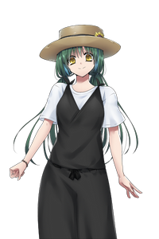
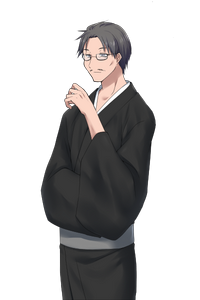
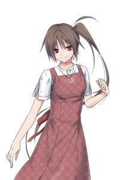
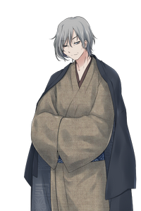

# Leaf Leaves

## シナリオ情報

- 推奨PL数2～5人
  - 互いに知り合いではないこと
- 新規PCを強く推奨
- 推奨技能:なし
  - 基本的に戦闘は想定していない
- 推奨職業:なし
- 目安時間: 不明

## 真相

- 探索者はヒプノスの作り出した偽の記憶から構築された人格を小世界(仮称)の体に埋め込まれた存在。
  - こうした人間はときどき現れるため、村人たちはそれを「よくあること」と受け止め、彼らを「来訪者」と読んでいる
  - 「来訪者」の多くは、現在の生活と折り合いを付けたりしているうちに、かつての記憶が薄れ小世界に馴染んでいく
- 自分のものと考えている記憶は実際あったもの

## 世界観・構造

- あまり文明は発達していないが、あまり土地が豊かなのかあまりあくせく働かなくても暮らしている
  - 農耕・牧畜などがメイン
  - 電気、ガスなどはない
  - 風車、水車などの動力は利用
- 豊かないためか、娯楽寄りのものは文明レベルの割りに発達している
  - 酒とか
  - 本は高価だが、一般市民に手が届かないというほどでもない
- 夢の導き手教会という宗教が緩やかな信仰されている
  - 
- この世界はテネレと呼ばれている(この設定はどっちでもいいや)
  - 現代人が「地球」と呼んでいるようなもの
  - メタ的な由来は[テネレの木](https://ja.wikipedia.org/wiki/テネレの木)
  - 孤立した世界

### 裏設定

- 樹木の葉の裏に住む微小な生物コロニーを擬人化したもの
  - ただし、厳密にその仕組みを参考にしているというよりは、着想レベル

### 夢の導き手教会

- 人の命も世界も生と死を繰り返している、という輪廻転生的な世界観を持った宗教
- とはいえ、日本の神社のような存在で、強い強制力を持った何かという訳ではない
- 緩やかに道徳の基準となっていたり、節目の行事として神事が執り行われる程度
- 紋章の蝶は、メタ的には胡蝶の夢に由来する

### 終末の過ごし方

- 終末の予兆が始まったら、人々は今ある食料を分配して、それぞれ家に篭るようになる
- 「次の世界でも会えるといいね」

## シナリオの流れ

1. 同じ部屋のベッドで目を覚ます
    - 元の持ち物は持っていない
    - 服装も覚えのない質素だが清潔な普段着になっている
    - SANc: 1/1D3
2. それに気づいたササラ(NPC)は探索者たちに声をかける
    - 「ようこそ、来訪者の皆さん」
3. ササラはこの世界のことをざっくり教えてくれた後に、探索者たちの記憶について聞く
    - 村人が
    - あまり深い意味はなく、探索者たちのキャラクタ紹介と愛着を持ってもらうための導入
4. 探索者ごとに「記憶」の場面をRPしてもらう
    - KPは探索者に応じて「現実」世界でのNPCをRPして、日常だったものを演出する
5. こちらの世界に戻ってササラに以下の説明を受ける(一方的な説明より会話になると良いだろう)
    - 探索者たちのために部屋を用意してあること
    - 探索者たちにこの世界の通貨を渡し、これを自由に使って良いこと
      - 2, 3ヶ月暮らしていける程度の額
    - 落ち着いたら、何か仕事をしてほしいこと
    - とはいえ、この世界では、そんなにあくせく働かなくても生活に困ることはないこと
      - 何となく、それぞれが役割を決めて、何かやってる
6. 探索フェイズ
    - 2, 3ヶ月、のんびり過ごしながら、この世界に馴染んでもらいながら進める
    - 長閑で、ついついのんびりしてしまう的な描写を入れるのも良いだろう
    - ちょいちょい、イベント的に探索を入れるくらいでいいだろう
7. 終末フェイズ
    - 予兆
      - 「最近、作物の育ちが悪くなってきたね」「そろそろ次の世界かな」
      - 村人たちは終末に対して、悲壮な思いは持っていない
      - 終末と誕生を繰り返していることを知っている
      - 年配者の中には終末を経験している者もいる
    - 終末

## NPC

立ち絵は[らぬきの立ち絵保管庫](http://ranuking.ko-me.com/)様よりお借りしています。

### ササラ

村長の娘。
20歳前後に見える。
探索者に最初に声をかける人。
割りとモブ。
元々の村民。
「ようこそ、来訪者の皆さん」

### ゴザ

村長。
40代後半に見える男性。
穏やかで親切。
良くも悪くもこの世界の常識に従って生きている。
「では皆さん、良い終末を」

### コズエ

かなり前にこの世界に来た来訪者。
30歳前後に見える女性。
かつての記憶に執着しており、この世界が何らかの作用で来訪者を閉じ込める仕組みになっているのではないかと疑っている。
その仮説を検証するため、この世界のことをずっと調べて過ごしている。
長年の研究の甲斐あって、この世界の外と通信する方法を見つけたようだが……
「私は元の世界に戻りたい」

### カンナ

コズエの友人。
30代前半程度に見える女性。
さっぱりした性格で押し付けがましいところはないが、割と信仰に厚いタイプ。
蝶と夢亭を切り盛りする主人。

### クサビ

夢の導き手教会の代表。
一見、取っ付きにくく見えるかもしれないが、話してみると気さくなおっさん。
教会の代表者だが、秩序を乱そうとしない限り、信仰についてあまりとやかく言うことはない。
「私も疑問に思うことはあります。でも、穏やかな暮らしに代えてまで解消したいとは思わない」

### モブ

何となくイメージを当てるために由来を設けているが、特別なギミック等はない。

#### 元々の住人、記憶の薄れた来訪者

基本的に動植物を材料にした道具に由来する名前

- カゴ
- サジ
- ヒゴ

### 記憶に執着し戻りたいと願っている来訪者

生きている動植物に由来する名前

- ワカバ
- シヨウ
- ハナ

#### 教会員、比較的敬虔な信者

植物が材料の製品(木、竹、革などの製品)を作る道具に由来する名前  
※とはいえ、教会員たちは特に来訪者たちに変化を強いるような思想を持っているわけではない

- キリ
- ヤスリ
- ツチ

-------------------------------------------------

## 探索場所

### 村長の家

- ゴザ、ササラが住んでいる

### 共同宿舎

- 探索者たちが住んでいる来訪者用の宿舎
- 来訪者たちには家を建てて出ていく者もいれば、面倒くさがって残っている者もいる

### 教会

- 世界観について知ることができる。
- クサビが相手をしてくれる

### 蝶と夢亭

- カンナが切り盛りする食堂兼飲み屋

### コズエのアトリエ

- コズエが住んでいる
- この場所のことはどこか探索して会話の中で聞く
- 一応、職業として絵を描いているのでアトリエ
- 実際はこの世界の研究に多くの時間を費やしている
  - これは特に隠しているわけではないし、周囲も変わり者だと思うくらいであまり気にしていない

### 村の適当な施設

適当に生やしてください

### 世界の縁

- 途中から進むごとにPOW対抗
  - このときの奇妙な感覚にSANc: 0/1
    - 1回だけで良い
- 到達することはできない
- POW対抗に失敗した探索者はかつての記憶の世界の様子を見る
  - ただし、そこにあなたはいない。あなたなしで回っている世界だ。
  - とてもリアルで、これはただの夢ではないと直感して良いだろう。
  - SANc: 1/1D6

### 世界の孔

- 最終局面以外は特に何も起こらない

-------------------------------------------------

## シナリオフロー

- 探索開始
- あちこち回ってこの世界のことを知る
  - コズエには少し回るまで到達しないようにする
- コズエのアトリエに行き、外の世界と交信できる世界の孔について知る
  - どうやら、その孔は終末のときにだけ空くらしい

### KPが探索者に出すべき情報

- 世界観全般
  - この世界の平和さ、豊かさ
  - 終末思想
    - 終末に恐怖を持っていない世界観
- 外の世界と交信できる場所がある
  - 世界の孔
  - コズエから
  - それは終末のときにだけ開く
- 記憶にある人物(自身)が本当に存在していたのか、という疑い
  - 過去の来訪者先輩たちとの会話
  - 教会代表との会話
    - 彼は決して敵対者ではない
    - 来訪者について、実は外の世界なんか存在しないのではないかという予測を持っている
      - これは半分正解
      - 実際は外の世界はある
      - ただし、記憶は捏造されたもので、探索者たちは元々存在していない

-------------------------------------------------

## エンディング

どれがTrue Endというのは特に決めていませんが、タイトル回収という意味でもED2がそれっぽい。

### ED1: repeat leaves

この世界に残ることを選択した場合。
つまり、普通に終末篭りをした場合。

探索者は小世界の終末を向かえる。
探索者たちは浮遊感を覚える。
「幸運-年齢+20(※)」のロールに成功した探索者は目を覚ます。  
※つまり、20歳を超えるほどに幸運からマイナス判定が入る

前のテネレによく似た世界だ。
何をすれば良いかは分かっている。
ここは良い土地だ。
周りを見回すと、見覚えのある顔がいくつもある。
「そういえば、前のテネレの前はどこにいたんだっけな？」
そんなことを思うかもしれない。
一瞬、その記憶が蘇えるが、すぐに靄の向こうに消えてしまった。
わずかに残る違和感。
だが、目の前に広がる豊な土地の前に、そんな違和感はすぐに吹き飛ばされてしまう。
あなたは、この新しい世界を前に心が高揚してくる。
この世界も悪くなさそうだ。
あなたに声がかかる。
「おお、XXもここに辿りついたんだな。新しい世界でもよろしくな！」

### ED2: leaf leaves

以下の条件を見たしたときに到達する

- コズエから世界の孔(アナ)について教えてもらい、飛び込む
- 自身の記憶が偽りのものであったことを理解している

コズエは迷うだろう。
本当に飛び込むことが正しいのだろうか？
他の人達が言うように、終末篭りをするべきでは？
この世界の一体、何が気に入らないというんだ？

………

探索者が後押ししない限り、彼女は飛び込むことはないだろう。

ともあれ、探索者が飛び込むと次のような描写になる。

どれくらい落ち続けただろう？
上の下も分からない。
ふと、老人(ノーデンスの化身)の声が聞こえてくる。
「お前たち、いったい何をしておるのだ？」

探索者たちは外の世界について話すだろう。
老人は尋ねる。
「ふむ、お前たちは外の世界に自分たちは存在しないのではないか、という想像は付いているのだろう？」
「それでもなお、外に行くことを望むのかね？」
「この世界のあり方がすばらしいとは言わんがね、外の世界よりは幾分マシなのではないかね？」

探索者がNoと答えればED1へ。
探索者が外の世界に出たいという強い意思を示した場合、以下に続く。

「ふむ、おもしろい者たちだな。いいだろう。私が特別におまえたちを外の世界に作ってやろうではないか」
「ただし、ただとはいかぬ。おまえたちの知力、体力、精神力いずれかを対価として頂こう」
YESの場合は、INT, CON, POWのいずれかを1D3永久に喪失します。

「しかし、さすがに新しい世界へ旅立つには心許ないか。これをさずけよう」
と言って、魔法「ノーデンスの守り」を習得します。
MP2消費で1D6ターン装甲を1得ます。最大で装甲3まで得られます。自身にのみ有効。

その声の後、探索者たちは意識を失う。
ふと起きると……
ここからはKPが探索者ごとに導入に応じた世界を描写してください。
RPもしてもらうといいでしょう。

### ED3: fallen leaves

- コズエから世界の孔(アナ)について教えてもらい、飛び込む
- 自身の記憶が偽りのものであったことを理解していない

テネレから放り出される。
老人の憐れみの籠った声が聞こえてくる。
「憐れなものがまた落ちていくか」

意識が途絶える。
いや違う。
途絶えたのは世界だ。
ここはどこだろう。
何も認識できない。
意識だけはある。
いや、本当に意識はあるのだろうか。
世界を認識できないのに自分というのもの認識できるだろうか？
分からない。
自分はまだあるのだろうか。
そんな自問をしたのかすら、認識できなくなってくる。

あなたは世界のどこに属さない空虚な空間で永遠に在り続ける。

## クリア報酬

探索者を使い回すこと考えてなかったので、決めてません。
ED2だと、一応、他のシナリオで使えるかな？
普通のクリアで1D10, コズエを連れてた場合は1D6のSAN回復くらいか？
