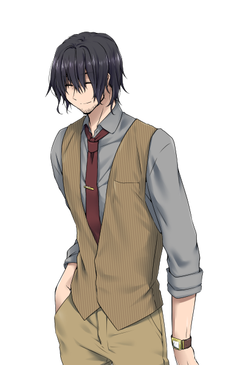

# +X

## シナリオ概要

誰もいなくなった世界に放り込まれるPC、NPCたち。
それぞれ、誰か1人の存在に違和感を覚える。
確かに知ってる、だけど、「こんな人いただろうか？」というかすかな違和感。

ただ1つを除いて、その違和感は作られた偽物だ。
栗栖茜はもともと存在しない……神話的事象によって作り上げられた人間だ。
元の世界に戻るには境界が曖昧になる黄昏時に、栗栖の目で観測されながら境界を超えなければならない。

それぞれ違った人物に違和感を感じるPC、NPCたちは互いに争うのだろうか？
かすかに残されたヒントから、本来存在しない栗栖を見つけ出して元の世界に戻ることができるのだろうか？
何の罪もない、記憶では友人だと思っていた栗栖を誰もいない世界に置き去りにして戻るのだろうか？
……それとも、別の選択肢を取るのだろうか？

## 基本情報

- PL: 3人(4人でも可)
- 目安時間: 4時間
- 舞台: 現代日本
- 推奨技能: なし
- 職業: 指定なし(「探索者向け事前情報」を踏まえて問題ない職業ならOK)

### 探索者向け事前情報

北と東西を川、南を海に囲まれた三角州にある三角(みつかど)市。
元々は氾濫原を利用した稲作を中心とした田舎町だったが、30年ほど前に三角大学が設立されてから学園都市として発展した地方都市である。
探索者たちは三角市にある古民家喫茶「るる家」の常連だ。

時は9月末の連休最終日の朝。
常連仲間と温泉旅行へ行き、帰ってきたところから物語は始まる。
見慣れたはずの街に帰ってきたはずなのだが、様子が少しおかしい……。

## シナリオ進行

### 共通ルート

1. 誰もいない街に帰還
2. 旅行の回想(登場人物の紹介を兼ねる)
3. 探索
    - 探索場所
        - 各自の自宅
        - るる家
            - 喫茶店内
            - マスターの部屋(2階)
        - 大学
            - 図書館
            - 構内(文学部棟)
            - 大学病院
    - 場所を限定しないイベント
        - 登場人物のうち、特定の1人に対して実在の人物ではないのではないかという違和感を覚える

### TRUE END クリスクロス: 栗栖と一緒に帰るルート

1. 彼岸の存在の目で境界の向こう側の者を観測することが脱出の条件だと知る(伝承)
2. 大学でリアルな人形を見つける(探索者より以前にこの空間に誘い込まれた被害者 鶯谷)
3. 大学図書館で呪文「器官の交換」を見つける
4. 人形に栗栖の目を移植して橋のこちらに設置
5. 探索者が橋を超える

### NORMAL END: 栗栖を置いて帰るルート

1. 彼岸の存在の目で境界の向こう側の者を観測することが脱出の条件だと知る(伝承)
2. 栗栖を説得
3. 栗栖に見守られながら橋を超える

### ANOTHER END: 栗栖の代わりに誰か残るルート

1. 彼岸の存在の目で境界の向こう側の者を観測することが脱出の条件だと知る(伝承)
2. 探索者の1人に栗栖の目を移植
3. 移植した探索者に見守られながら橋を超える

## 舞台

日本を代表する大河を分かつ大きな三角州にある街、三角(みつかど)市。
三角市には再開発の一環で大学=三角(みつかど)大学が作られ、昔ながらの田畑と商店街、大学の周りの新しい施設や店が混在している。
昔から住んでいる人たちは、戸惑いながらもどちらかと言えば好意的に変化を受け入れている人が多い。

三角州から出るには東西それぞれに数本ずつかかっている橋を渡る必要がある。
(探索者たちは東側にかかる橋から朝日を背に帰ってきた)

三角町は元々、三角州の中ということもあり、水害も多い土地だった。
一方で大河を渡る交通の要衝、また氾濫によってできた豊かな土地での稲作農業で発展した土地でもある。
治水技術が発達するにつれて他の用地も増え、三角大学の創設を機に学園都市としての発展も見せている。


## PC設定

PCたちは三角町の住人で古民家カフェ「るる家」の常連である。
三角町は学園都市として再開発されているので、学生という設定がスムーズであるが、他にも任意の職業で良い。
PCたちと幾人かの常連(NPC)が一緒に旅行に行き、帰ってきたところから物語はスタートする。

PCたちと他の常連は当然知り合いということになる。
NPCについては物語が始まってから紹介するので、特に知り合い設定について気にしなくて良い。

## NPC

画像は[らぬきの立ち絵保管庫様](http://ranuking.ko-me.com/)からお借りしました。

### 栗栖茜(くりす あかね)

るる家でバイトをしている20代前半の女性。
喫茶「るる家」で働いている……という記憶を本人も含めて皆が持っている。
ハーブ好きで、自前の小さなハーブ園を持っている。

PC、NPCたちの記憶にあるが、本来存在しなかった人間。
ただし、それは本人にも自覚はない。


### 橿原藍(かしはら あい)

三角大学工学部に所属する学生。
今どき珍しいラジオ好き。


### 槙野忍(まきの しのぶ)

大学病院に勤める医者の40過ぎの男性。
穏やかな人柄で酒と読書を愛する。


### るる家マスター 二川留衣(ふたがわ るい)

古民家喫茶るる家のマスターをしている40代の男性。
るる家は名前の「る」が名字の「二」つというところから取っていると説明している。
古い物の収集癖があり、店内は趣味で集めたものが飾られていたりする。
昔、向こう側の世界に行って帰ってきた経験を持つ。
その時に新しく作られた友人「流花」を連れて帰ってくることはできなかった。



## 導入: 帰還の朝

「おーい、もうすぐ着くよ」
そんな声で居眠りをしていた探索者たちは目を覚ます。
声の主は運転手、40代ほどの穏やかな風体の男性である。
男性はあなたたちと同じく古民家喫茶「るる家(るるや)」の常連で槙野である。
外を見回すと、そこはあなたたちの街、三角市と外界を隔てる川にかかる橋の上だった。

覚醒する中で探索者たちは思い出す。
今は連休を利用して、るる家の常連たちと温泉旅行に行った帰りだ。
誰かが今日の昼に用事があるということで、朝の暗いうちに出ての帰路だった。
楽しかった温泉旅行も終わり、日常に戻るところだ。

ここで、PC、NPCの紹介も兼ねて温泉旅行を回想する。

### 回想

場面は温泉宿での食事の席。
「いや、美味い酒だね」
そう話しかけてくるのは槙野忍だ。
大学病院に勤める医者である。
彼は出された山の幸を肴に美味そうに酒を飲んでいる。
以降の会話は自由にしてもらって構わないが以下のようなセリフを混ぜるようにしよう。
「そういえばね、うちの大学ってときどき妙な研究してるみたいなんだよね」
「おっと、酒で口が滑ったかな。人の研究を悪く言うものじゃないね」
後で、医学研究室に行く伏線となる。

「山葡萄がたくさん採れたんですよ。喫茶店で出すお菓子に使うのもいいですねー」
そう話しているのは栗栖茜だ。
今回旅行には不在のマスターのもと、るる家の店員として働いている。
以降の会話は自由にしてもらって構わないが以下のようなセリフを混ぜるようにしよう。  
「きっとハーブティーとも合いますよ」  
「帰ったら、一緒に出しますね」  
後で、喫茶店のメニューに違和感を覚える伏線となる。

「いやー、片田舎の温泉なんてどうかと思ったけど、たまにはいいもんですね」
ほろ酔い加減で上機嫌に語るのは橿原藍だ。
三角大学で工学部だと言う話は常連仲間のあなたたちは聞いたことがあるだろう。

ここでNPCとPCたちの会話を通してキャラクタ紹介をしておく。
PC同士の紹介もここですると良いだろう。

### 再び場面は戻る

場面は戻って、帰路に着く車内だ。
「ん、妙だな」
槙野はつぶやくと同乗者たちを見る。
ここで探索者たちは目星をロールできる。

目星に成功した探索者は違和感に気づく。
朝早いとはいえ、対向車が1台もないのは奇妙だ。
そう思って街の方を見ると、一切の人気がない。
えも言われぬ違和感を覚える。
SANチェック0/1

ここでの目星には特殊な意味がある。
目星のダイスの値が小さい順にPC1, 2, 3(, 4)とする。
この順番は「るる家」初回到着時の処理のためだけに使う。
なお、同値の場合はKPが好きに決めて良い。
(そもそも、これ以外の手法で順番を決めても良い)

サークル仲間たちと旅行先から戻ると、そこは誰もいない街だった。
昇ってきた太陽があなたたちから影法師を落とす。
何も言葉を発さないそれが、街の静けさを強調する。
(最後に元の街に戻るときに、落ちる太陽が探索者たちから影法師を伸ばす云々という形にする)
この異様な現象に探索者たちはSANチェック1/1d4

探索者たちが特にアクションを起こさなければ、槙野がとりあえずそれぞれの自宅に戻ってみようかと提案する。

## 探索のルール

午前に1回、午後に1回の探索ができる。
手分けして探すのはある程度は構わないが、2手より分かれるのは避けてほしいと伝える。
また、離れた場所を移動するには槙野の車がなければ難しいだろう。

## 三角市内の状況

基本的には探索者が知る三角市だが、人間がすっぽり抜け落ちてしまったような状態である。

### 電気・ガス・水道などのインフラ

止まっている。
従って冷蔵保存が前提の食べ物などはすぐに悪くなってしまうだろう。
また、夜は月や星の明かりだけとなる。

### スマホ・携帯電話

電源は入るが、圏外になっており、通話・ネットの利用はできない。
バッテリーが残っている限り、オフライン機能(電灯など)は使用できる。

### 東西の橋

渡ろうとすると元に戻ってしまう。
川や海を泳いだり船等を使ったりして渡ろうとしても、意識が遠くなり、気づくと元の場所に戻ってしまう。
この現象を体験した探索者たちはこの無人の街から出られないという現実に恐怖を覚える。
SANチェック1/1d3

2回目以降はより確信を深めることとなる。
SANチェック0/1

## イベント

### 探索

#### るる家

##### 初回到着時

PC、NPCたちはふと特定の人物に違和感を覚えることになる。
「特定の人物」は下記のように1周するようにする。

PC1→栗栖茜→PC2→橿原藍→PC3→槙野忍(→PC4)→PC1  
(正しい違和感はPC1が持っていることになる)

この違和感は秘匿HOとして送る。

```text
[PC1]
あなたは栗栖茜の存在に一瞬の違和感を覚える。
こんな人、いただろうか？
いや、何を考えている？
確かに知っている人物だ。
```

```text
[PC2]
あなたは橿原藍の存在に一瞬の違和感を覚える。
こんな人、いただろうか？
いや、何を考えている？
確かに知っている人物だ。
```

```text
[PC3]
あなたは槙野忍の存在に一瞬の違和感を覚える。
こんな人、いただろうか？
いや、何を考えている？
確かに知っている人物だ。
```

##### 喫茶店内

それほど多くの人は入れない狭い店内だ。
いつもは客がマスターが煎れてくれるコーヒーなどを楽しんでいる。
コーヒーが好きな人、雰囲気が好きな人、理由は人それぞれだが、ここが気に入った人たちが数人、常連となって入り浸っている。

アイデアまたは目星をロールできる。

アイデアに成功した探索者は、2階がマスターの住居となっていることに思い当たる。
カウンターの奥に階段があることにもすぐ気づくだろう。

目星に成功した探索者は喫茶店のメニューが目につく。
何種類かのコーヒーとサンドイッチ程度の軽食が書かれた簡素なメニューだ。  
導入で発言していた、ハーブティーなどのメニューが無く、栗栖の発言との食い違いに気づかせるキッカケとすることを想定している。

##### マスターの部屋

机とベッド、書棚のある簡素な部屋だ。
目星あるいは図書館がロールできる。
成功するとマスターの日記が見つかる。
気になる箇所は2つだ。
手分けして探しても良いが、1人で探す場合は2回分の探索時間を使う必要がある。

古い日記には、誰もいない三角市に行って戻ってきた過去について書いてある。
そこでは流花という女性と一緒だった。
彼女は現実世界には存在していない人物だったということ、
彼女を置いていくことで自分は現実世界に帰ることができたことなどが書いてある。

```text
[2001年9月26日]
私達は何とか、あの恐しい街から戻ることができた。
いったいあの場所は何だったのだろう？
流花はいったい何者だったんだろう？

私達の……少なくとも私の中には彼女の記憶があった。
一方で実在しない人間だという確信もあった。
どちらが本当なのか、今はもう分からない。
あんな不確かな伝承を信じて……いや、縋ったというのが正しいか。

確かなことをは、彼女を置いてくることで私達が戻って来られた、それだけだ。
```

比較的新しい日記(現在が2022年くらいで7,8年前を想定しているが特に重要ではない)には、
店を出したときのことが書いてある。
向こう側の人である流花への思い入れが書かれている。
あるいは、連れて帰れなかったことへの後悔があるのかもしれない、と読み取ることもできるかもしれない。

```text
[2013年9月23日]
ちょっとした縁で、この地で店を持つことになった。
古民家を安く譲ってもらえたのだ。
少し改装して、喫茶店にするのだ。
夜は酒を出してもいいかもしれない。

狭い店だ。人を雇う必要もないだろう。
大学ができて随分と人も増えた。
1人分の食い扶持を稼ぐ程度にはやっていけそうだ。

今日は……12年前にあの不思議な体験をした日か。
これも何かの縁だ。
もう二度と合うことのないあの人、流花と私の名前から1文字ずつ。
「るる家」としよう。
```

#### 大学: 図書館

得たい情報をある程度、指定すれば出して良い。
特に指定がない場合は図書館またはオカルトロールに成功で以下の情報を出す。
(これはあまり意味のない情報)

```text
[座敷童の話]
あるお屋敷にお嫁さんが来た
近所の子どもがお祝いに呼ばれて
奧の座敷で遊んでた

ところがみんなで遊んでいるうちに
子供が1人増えていた
増えたのどの子？
あの子？この子？
それは誰にも分からない
```

伝承、言い伝えのようなワードがあった場合は、図書館ロールに成功で以下の情報を出す。
失敗した場合も

```text
[三角の神隠し]
三角では時々、隣町に出かけた人が帰って来ないことがあった。
昔々の話で、そのときは神隠しだと言って、それなりの騒ぎにはなったらしい。
それだけなら、よくある昔話だ。

ところが、ある時、妙なことを言い出す者がいたと言う。
その者の言葉によると、三角に帰ってきたつもりだが、そこには人っ子一人いない。
自分と連れのものだけだったという。
薄気味悪くなって引き返したが、今度はその誰もない三角から出ることができない。
困り果てて何日かうろついていたが、疲れからか次第に体が重くなってきた。
そうしているとある時、連れが西の橋から抜けてごらんと言い出した。
縋るものも他にないから、それならと夕日に向かって橋を渡る。
一緒に行くものだと思っていた連れは橋の途中で止まる。
不思議に思って尋ねると「私が、こっち側の者が見ておらんと、ここは渡れんでな」と言う。
よく分からないまま一人で橋を渡ると、気づけばそこはいつもの三角だった。
妙な体験はしたものの、その者は無事帰れたのだ。

ただ、もう1つ妙なことがある。
無事帰ったその者は三角の人に連れの話をするが、そんな人物は誰も知らなかったと言う。
```

##### 大学構内

何か手掛かりがないかと歩き回る。
ここで目星をロールできる。
成功すると、以下のような張り紙が目に入る。

```text
文学部4年生の鴬谷隆志さんと連絡が取れなくなっています。
どなたか心当たりの方は鴨川ゼミまでご一報ください。
[顔写真]
```

##### 鴨川ゼミ

文学部棟の鴨川ゼミに入ると、顔写真の通りの人物の蝋人形がある。
いや、そう思った近付いて触れると蝋人形ではないことが分かる。
温かくもなく冷たくもない。
硬くもなく柔らかくもない。
しかし、それが確かに人間なのではないと理解する。
SANチェック1/1d3

#### 大学: 医学研究室

研究棟を歩き回っていると、医学研究室としてはやや奇妙な一角が見つかる。
最新の医学研究をしているはずの場所に、少しオカルトめいた佇まいの部屋があるのだ。
部屋に入ると書棚が見つかる。
目星または図書館ロールを振ることができる。
成功すると書物「魔術による臓器移植の手法」が見つかる。
これを読むには1探索時間が必要となる。
また、あまりにも常軌を逸した内容、そしてそれが実現可能であることを確信してしまったことに
SANチェック1/1d3をロールすることとなる。
読んだ探索者は次の呪文を覚える。

```text
「器官の交換」
2人の人物の器官を交換することができる。
通常の臓器移植とは異なり、拒絶反応なしにできることが特長である。
肺、肝臓、心臓などの臓器の他、目や皮膚などの感覚器官も交換可能である。
ただし、2人の対象が交換に同意しているか、あるいは完全に魂を失っている必要がある。
この呪文の利用者はPOWを1とSAN値を1d6消費する。
交換の対象になったものはSAN値を1d3消費する。
```

### ラジオの音: 初日の夕方

陽が沈む頃、橿原が「あ、そういえばラジオ入らないかな。よくこの時間に聞いてる番組があるんだけど」と言い出して電源を付ける。
しばらくはザーザーっというノイズばかりだが、あちこち角度を調整していると、時折、かすかな音楽や人の声が聞こえる。
聞き耳かアイデアがロールできる。
成功すると西の方角に向けたときに声が聞こえることが分かる。
また西側の橋に近付くと少しクリアになる。

しばらくして、日が落ちるとまたノイズだけになる。

これは西側の橋を通って現世に帰ることへのヒントとなっている。

### 目覚め

朝、目が覚めると体が少し重い。
全員DEXを-1する。
これは1日経つごとに発生する。

なお、シナリオとしては何日も滞在することを想定はしていない。
探索者たちに緊迫感を持たせるためのギミックである。
このマイナスはこの奇妙な三角を出た時点で解消する。

### 栗栖への疑念

栗栖に対して、実在しない人物ではないかという状況証拠を突きつけると、彼女の自身の存在に疑いを持つようになる。
具体的には、以下の内容である。

- 栗栖が出していたはずのハーブティーのメニューも材料も喫茶店にない
- マスターの日記によるとバイトが必要ないような店である

他にも、実在に疑念をもたせるような材料があれば自由に加えて構わない。
この事実を突きつけられてから、栗栖は考え込むような表情になり、言葉少なになる。
1日程度の時間経過後、自身が本来存在しない人間だという結論に至る。

結論に至った後も、積極的なアクションは取らないが、伝承の通り、「こちら側の人間」として見送る役をしてほしいと頼まれれば応じるようになる。
また、あまり想定したパターンではないが、PCのDEXが翌朝に0になるような場合には、そのPCとの関係性によっては見送る役を買って出させてもよい。

### (クライマックス)帰還の夕べ

夕日が落ちる方向に向かって探索者たちは歩みを進める。
沈んでいく太陽があなたたちの背後に影法師を落とす。

### TRUE END +クリス・クロスx : 栗栖と一緒に帰るルート

物言わぬ人形に見送られて橋を渡る。
振り返ると、茜色の夕日に照らされた土手にはヒバンバナが咲き誇る。
その光景は、その名の通り、まるで現世とは別世界、向こう岸、彼岸の風景に見えた。
夕日に向かって歩みを進めるうちに意識が遠のく。

そして気づくとこの世界に渡ってきた橋の上だ。
槙野の乗る車に乗っている。
車が一瞬、大きく蛇行する。
対向車からクラクションが鳴らされる。
「おっと、すまない」
半ば呆然としながらも、ハンドルを握り直したのは槙野だ。
フロントガラスの向こうを見れば、そこは見慣れた街だ。
帰ってきたのだ、この街に。

#### 後日談

旅行から帰り、いったん「るる家」に降りる。
ちょうど、マスターが店の支度をしているところだった。
帰ってきた皆に気づいたマスターは
「おかえりなさい、旅行はどうでした？」
と問いかけてくる。

そして皆の方に向けるマスターの視線が栗栖に向いたとき、その顔は驚いたように止まる。
「流花……！？」
栗栖は一瞬キョトンとしたのちすっと表情を変えて話し出す。
「久しぶり。でもこの子は流花じゃない。私はもういないんだ。でも、最後にこうして元気にやってる様子が見られて良かったよ。じゃあね！」
そう言うとまた表情が戻る。
「あ、あの、私、ここで働きたいんですけど……」
おずおずと栗栖は言う。
マスターはなにかを察したのか快諾する。
探索者や他の常連たちはまたいつもの喫茶での日常を紡ぐことでしょう。
新しい仲間を迎えて。

<完>

### NORMAL END +クリス・エンプティφ: 栗栖を置いて帰るルート

寂しげな表情をする栗栖に見送られて橋を渡る。
ここで探索者は聞き耳ロールを振る。
聞き耳に成功した探索者は「私も帰りたかったな」とつぶやく栗栖の声が聞こえる。

振り返ると、茜色の夕日に照らされた土手にはヒバンバナが咲き誇る。
その光景は、その名の通り、まるで現世とは別世界、向こう岸、彼岸の風景に見えた。
夕日に向かって歩みを進めるうちに意識が遠のく。

そして気づくとこの世界に渡ってきた橋の上だ。
槙野の乗る車に乗っている。
車が一瞬、大きく蛇行する。
対向車からクラクションが鳴らされる。
「おっと、すまない」
半ば呆然としながらも、ハンドルを握り直したのは槙野だ。
フロントガラスの向こうを見れば、そこは見慣れた街だ。
帰ってきたのだ、この街に。

ただし、みんなの記憶にある栗栖はもういない。

#### 後日談

旅行から帰り、いったん「るる家」に降りる。
ちょうど、マスターが店の支度をしているところだった。
帰ってきた皆に気づいたマスターは
「おかえりなさい、旅行はどうでした？」
と問いかけてくる。

「温泉旅行の帰りにしては、どこか顔色が冴えないようだけど……。何かありました？」
探索者たちはあの無人の三角市に言ったことを、同じ体験をしたマスターに話すかもしれない。
そして同じように仲間を置いてきたことも……。

<完>

### ANOTHER END +クリス・イマジナリーi: 栗栖の代わりに誰か残るルート

残る人物に見送られて探索者たちは橋を渡る。
振り返ると、茜色の夕日に照らされた土手にはヒバンバナが咲き誇る。
その光景は、その名の通り、まるで現世とは別世界、向こう岸、彼岸の風景に見えた。
夕日に向かって歩みを進めるうちに意識が遠のく。

そして気づくとこの世界に渡ってきた橋の上だ。
槙野の乗る車に乗っている。
車が一瞬、大きく蛇行する。
対向車からクラクションが鳴らされる。
「おっと、すまない」
半ば呆然としながらも、ハンドルを握り直したのは槙野だ。
フロントガラスの向こうを見れば、そこは見慣れた街だ。
帰ってきたのだ、この街に。
あの人の犠牲を代償に。

<完>

## クリア報酬

- SAN回復
  - 栗栖以外の全員の生還: 1d4
  - 栗栖を含めた全員の生還: 2d4
- クトゥルフ神話技能: 5%

## 裏設定

元々、CROSS†CHANNELをTRPGシナリオにできないかということで書き始めたが、結局、全然違うシナリオになった。
最終的には主要なところでは導入とタイトルがそれっぽくなっているくらい。
ただし、物語中のちょっとしたところで影響は残っているかもしれない。

書いている途中で影響を受けたのは日食なつこさんの「茜のキャラバン」。
終わりと始まり、新しい場所、別れ、旅立ち、そんな歌詞がぴったりはまった……というか、これに(良い意味で)引き摺られた部分もあるかもしれない。
